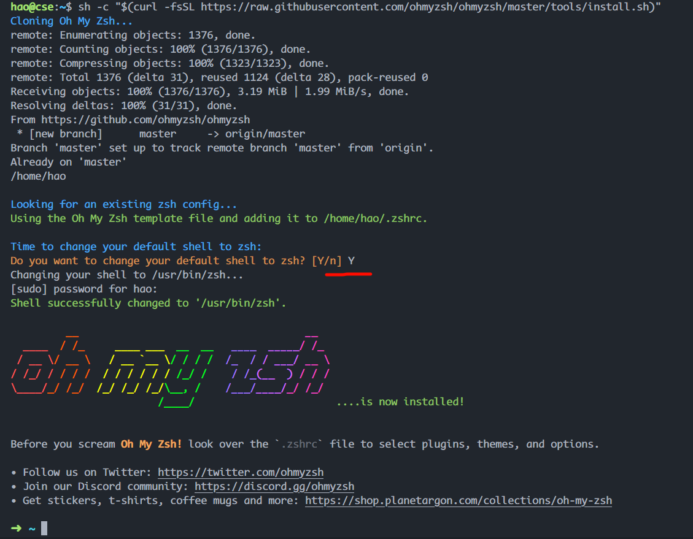
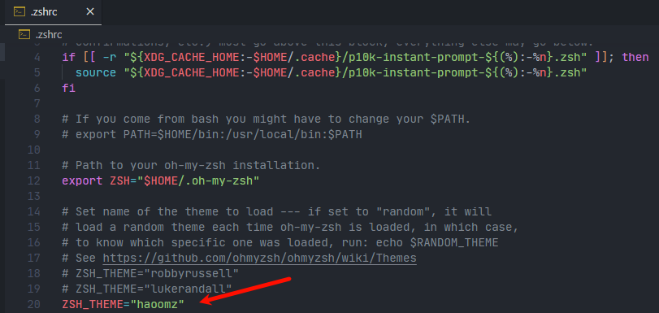
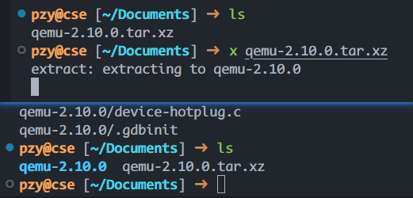
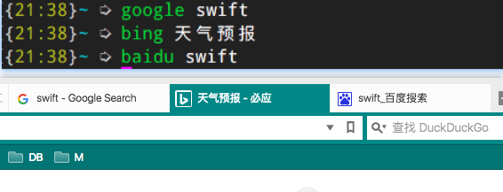
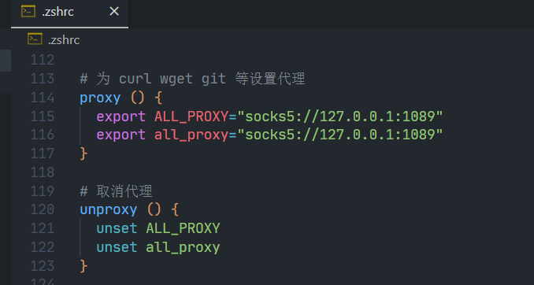

传统的 bash 功能比较简陋，且不美观。本文基于 Ubuntu22.04 LTS 系统，安装 zsh，并使用 oh-my-zsh 对终端进行美化。Oh My Zsh 是基于 zsh 命令行的一个扩展工具集，提供了丰富的扩展功能。

## 1 环境配置[](https://www.haoyep.com/posts/zsh-config-oh-my-zsh/#%e7%8e%af%e5%a2%83%e9%85%8d%e7%bd%ae)

### 1.1 安装基本工具[](https://www.haoyep.com/posts/zsh-config-oh-my-zsh/#%e5%ae%89%e8%a3%85%e5%9f%ba%e6%9c%ac%e5%b7%a5%e5%85%b7)
```shell
# 更新软件源
sudo apt update && sudo apt upgrade -y
# 安装 zsh git curl
sudo apt install zsh git curl -y
```

设置默认终端为 zsh（**注意：不要使用 sudo**）。

```shell
chsh -s /bin/zsh
```

### 1.2 安装 oh-my-zsh[](https://www.haoyep.com/posts/zsh-config-oh-my-zsh/#%e5%ae%89%e8%a3%85-oh-my-zsh)

官网：[http://ohmyz.sh/](http://ohmyz.sh/)。 安装方式任选一个即可。

| Method                                       | Command                                                                              |
| -------------------------------------------- | ------------------------------------------------------------------------------------ |
| **curl**                                     | `sh -c "$(curl -fsSL https://install.ohmyz.sh/)"`                                    |
| **wget**                                     | `sh -c "$(wget -O- https://install.ohmyz.sh/)"`                                      |
| **fetch**                                    | `sh -c "$(fetch -o - https://install.ohmyz.sh/)"`                                    |
| 国内curl[镜像](https://gitee.com/pocmon/ohmyzsh) | `sh -c "$(curl -fsSL https://gitee.com/pocmon/ohmyzsh/raw/master/tools/install.sh)"` |
| 国内wget[镜像](https://gitee.com/pocmon/ohmyzsh) | `sh -c "$(wget -O- https://gitee.com/pocmon/ohmyzsh/raw/master/tools/install.sh)"`   |

注意：同意使用 Oh-my-zsh 的配置模板覆盖已有的 `.zshrc`。

[](https://cdn.haoyep.com/gh/leegical/Blog_img/cdnimg/202401012224221.png?size=large)

### 1.3 从`.bashrc`中迁移配置（可选）[](https://www.haoyep.com/posts/zsh-config-oh-my-zsh/#%e4%bb%8ebashrc%e4%b8%ad%e8%bf%81%e7%a7%bb%e9%85%8d%e7%bd%ae%e5%8f%af%e9%80%89)

如果之前在使用`bash`时自定义了一些环境变量、别名等，那么在切换到`zsh`后，你需要手动迁移这些自定义配置。

```shell
# 查看bash配置文件，并手动复制自定义配置
cat ~/.bashrc
# 编辑zsh配置文件，并粘贴自定义配置
nano ~/.zshrc
# 启动新的zsh配置
source ~/.zshrc
```

`root`用户在执行`sudo su`命令后，再运行上述代码查看、手动复制、粘贴自定义配置。

## 2 配置主题[](https://www.haoyep.com/posts/zsh-config-oh-my-zsh/#%e9%85%8d%e7%bd%ae%e4%b8%bb%e9%a2%98)

### 2.1 自定义主题[](https://www.haoyep.com/posts/zsh-config-oh-my-zsh/#%e8%87%aa%e5%ae%9a%e4%b9%89%e4%b8%bb%e9%a2%98)

```shell
sudo wget -O $ZSH_CUSTOM/themes/haoomz.zsh-theme https://cdn.haoyep.com/gh/leegical/Blog_img/zsh/haoomz.zsh-theme
```

编辑 `~/.zshrc` 文件，将 `ZSH_THEME` 设为 `haoomz`。当然你也可以设置为其他主题，例如`lukerandall`、`robbyrussell`。
```shell
vim ~/.zshrc

ZSH_THEME="haoomz"

source ~/.zshrc
```
[](https://cdn.haoyep.com/gh/leegical/Blog_img/cdnimg/202401012235958.png?size=large)

效果如下（`robbyrussell` → `haoomz`）：

[](https://cdn.haoyep.com/gh/leegical/Blog_img/cdnimg/202401012238625.png?size=large)

### 2.2 推荐主题[](https://www.haoyep.com/posts/zsh-config-oh-my-zsh/#%e6%8e%a8%e8%8d%90%e4%b8%bb%e9%a2%98)

你可以在[内置主题样式截图](https://github.com/ohmyzsh/ohmyzsh/wiki/Themes)中查看所有 zsh 内置的主题样式和对应的主题名。这些内置主题已经放在 ～/.oh-my-zsh/themes 目录下，不需要再下载。
```shell
cd ~/.oh-my-zsh/themes && ls
```
[](https://cdn.haoyep.com/gh/leegical/Blog_img/cdnimg/202401012242407.png?size=large)

#### 2.2.1 powerlevel10k[](https://www.haoyep.com/posts/zsh-config-oh-my-zsh/#powerlevel10k)

根据 [What’s the best theme for Oh My Zsh?](https://www.slant.co/topics/7553/~theme-for-oh-my-zsh) 中的排名，以及自定义化、美观程度，强烈建议使用 [powerlevel10k](https://github.com/romkatv/powerlevel10k) 主题。

```shell
git clone --depth=1 https://github.com/romkatv/powerlevel10k.git ${ZSH_CUSTOM:-$HOME/.oh-my-zsh/custom}/themes/powerlevel10k

# 中国用户可以使用 gitee.com 上的官方镜像加速下载
git clone --depth=1 https://gitee.com/romkatv/powerlevel10k.git ${ZSH_CUSTOM:-$HOME/.oh-my-zsh/custom}/themes/powerlevel10k
```
在 `~/.zshrc` 设置 `ZSH_THEME="powerlevel10k/powerlevel10k"`。接下来，终端会自动引导你配置 `powerlevel10k`。

## 3 安装插件[](https://www.haoyep.com/posts/zsh-config-oh-my-zsh/#%e5%ae%89%e8%a3%85%e6%8f%92%e4%bb%b6)

`oh-my-zsh` 已经内置了 `git` 插件，内置插件可以在 `～/.oh-my-zsh/plugins` 中查看，下面介绍一下我常用的插件，更多插件可以在 [awesome-zsh-plugins](https://github.com/unixorn/awesome-zsh-plugins) 里查看。

### 3.1 插件推荐[](https://www.haoyep.com/posts/zsh-config-oh-my-zsh/#%e6%8f%92%e4%bb%b6%e6%8e%a8%e8%8d%90)

#### 3.1.1 zsh -autosuggestions[](https://www.haoyep.com/posts/zsh-config-oh-my-zsh/#zsh--autosuggestions)

[zsh-autosuggestions](https://github.com/zsh-users/zsh-autosuggestions) 是一个命令提示插件，当你输入命令时，会自动推测你可能需要输入的命令，按下右键可以快速采用建议。效果如下：

[](https://cdn.haoyep.com/gh/leegical/Blog_img/cdnimg/202401012250028.png?size=large)

安装方式：把插件下载到本地的 `~/.oh-my-zsh/custom/plugins` 目录。
```shell
git clone https://github.com/zsh-users/zsh-autosuggestions ${ZSH_CUSTOM:-~/.oh-my-zsh/custom}/plugins/zsh-autosuggestions

# 中国用户可以使用下面任意一个加速下载
# 加速1
git clone https://github.moeyy.xyz/https://github.com/zsh-users/zsh-autosuggestions ${ZSH_CUSTOM:-~/.oh-my-zsh/custom}/plugins/zsh-autosuggestions
# 加速2
git clone https://gh.xmly.dev/https://github.com/zsh-users/zsh-autosuggestions ${ZSH_CUSTOM:-~/.oh-my-zsh/custom}/plugins/zsh-autosuggestions
# 加速3
git clone https://gh.api.99988866.xyz/https://github.com/zsh-users/zsh-autosuggestions ${ZSH_CUSTOM:-~/.oh-my-zsh/custom}/plugins/zsh-autosuggestions
```
#### 3.1.2 zsh-syntax-highlighting[](https://www.haoyep.com/posts/zsh-config-oh-my-zsh/#zsh-syntax-highlighting)

[zsh-syntax-highlighting](https://github.com/zsh-users/zsh-syntax-highlighting) 是一个命令语法校验插件，在输入命令的过程中，若指令不合法，则指令显示为红色，若指令合法就会显示为绿色。效果如下：

[](https://cdn.haoyep.com/gh/leegical/Blog_img/cdnimg/202401012252786.png?size=large)

安装方式：把插件下载到本地的 `~/.oh-my-zsh/custom/plugins` 目录。
```shell
git clone https://github.com/zsh-users/zsh-syntax-highlighting.git ${ZSH_CUSTOM:-~/.oh-my-zsh/custom}/plugins/zsh-syntax-highlighting

# 中国用户可以使用下面任意一个加速下载
# 加速1
git clone https://github.moeyy.xyz/https://github.com/zsh-users/zsh-syntax-highlighting.git ${ZSH_CUSTOM:-~/.oh-my-zsh/custom}/plugins/zsh-syntax-highlighting
# 加速2
git clone https://gh.xmly.dev/https://github.com/zsh-users/zsh-syntax-highlighting.git ${ZSH_CUSTOM:-~/.oh-my-zsh/custom}/plugins/zsh-syntax-highlighting
# 加速3
git clone https://gh.api.99988866.xyz/https://github.com/zsh-users/zsh-syntax-highlighting.git ${ZSH_CUSTOM:-~/.oh-my-zsh/custom}/plugins/zsh-syntax-highlighting
```
#### 3.1.3 z[](https://www.haoyep.com/posts/zsh-config-oh-my-zsh/#z)

`oh-my-zsh` 内置了 `z` 插件。`z` 是一个文件夹快捷跳转插件，对于曾经跳转过的目录，只需要输入最终目标文件夹名称，就可以快速跳转，避免再输入长串路径，提高切换文件夹的效率。效果如下：

[](https://cdn.haoyep.com/gh/leegical/Blog_img/cdnimg/202401012254065.png?size=large)

`oh-my-zsh` 内置了 `extract` 插件。`extract` 用于解压任何压缩文件，不必根据压缩文件的后缀名来记忆压缩软件。使用 `x` 命令即可解压文件，效果如下：

[](https://cdn.haoyep.com/gh/leegical/Blog_img/cdnimg/202401012259966.png?size=large)

#### 3.1.5 web-search[](https://www.haoyep.com/posts/zsh-config-oh-my-zsh/#web-search)

oh-my-zsh 内置了 `web-search` 插件。`web-search` 能让我们在命令行中使用搜索引擎进行搜索。使用`搜索引擎关键字+搜索内容` 即可自动打开浏览器进行搜索。效果如下：

[](https://cdn.haoyep.com/gh/leegical/Blog_img/cdnimg/202401012302476.png?size=large)

### 3.2 启用插件[](https://www.haoyep.com/posts/zsh-config-oh-my-zsh/#%e5%90%af%e7%94%a8%e6%8f%92%e4%bb%b6)

修改`~/.zshrc`中插件列表为：

```shell
plugins=(git zsh-autosuggestions zsh-syntax-highlighting z extract web-search)
```
[](https://cdn.haoyep.com/gh/leegical/Blog_img/cdnimg/202401012304774.png?size=large)

开启新的 Shell 或执行 `source ~/.zshrc`，就可以开始体验插件。

## 4 Tips[](https://www.haoyep.com/posts/zsh-config-oh-my-zsh/#tips)

### 4.1 root 用户[](https://www.haoyep.com/posts/zsh-config-oh-my-zsh/#root-%e7%94%a8%e6%88%b7)

当你配置好登陆用户的 zsh 后，如果使用`sudo su`命令进入`root`用户的终端，发现还是默认的`bash`。建议在`root`用户的终端下，也安装`on my zsh`，设置与普通用户不同的主题以便区分，插件可以使用一样的。 `root`用户的`~/.zshrc`配置，仅供参考：

```shell
ZSH_THEME="ys"
plugins=(git zsh-autosuggestions zsh-syntax-highlighting z extract web-search)
# 或
plugins=(git colored-man-pages colorize cp man command-not-found sudo suse ubuntu archlinux zsh-navigation-tools z extract history-substring-search python zsh-autosuggestions zsh-syntax-highlighting)
```
### 4.2 配置本地代理[](https://www.haoyep.com/posts/zsh-config-oh-my-zsh/#%e9%85%8d%e7%bd%ae%e6%9c%ac%e5%9c%b0%e4%bb%a3%e7%90%86)

如果你配置了本地代理，并希望终端的 git 等命令使用代理，那么可以在`~/.zshrc`中添加：

```shell
# 为 curl wget git 等设置代理
proxy () {
  export ALL_PROXY="socks5://127.0.0.1:1089"
  export all_proxy="socks5://127.0.0.1:1089"
}

# 取消代理
unproxy () {
  unset ALL_PROXY
  unset all_proxy
}
```
[](https://cdn.haoyep.com/gh/leegical/Blog_img/cdnimg/202401012307093.png?size=large)

以后在使用 `git` 等命令之前，只需要在终端中输入 `proxy` 命令，即可使用本地代理。

#### 4.2.1 WSL 配置本地代理[](https://www.haoyep.com/posts/zsh-config-oh-my-zsh/#wsl-%e9%85%8d%e7%bd%ae%e6%9c%ac%e5%9c%b0%e4%bb%a3%e7%90%86)

```shell
host_ip=$(cat /etc/resolv.conf |grep "nameserver" |cut -f 2 -d " ")
# 为 curl wget git npm apt 等设置代理
proxy () {
  export ALL_PROXY="http://$host_ip:10811"
  export all_proxy="http://$host_ip:10811"
 # echo -e "Acquire::http::Proxy \"http://$host_ip:10811\";" | sudo tee -a /etc/apt/apt.conf > /dev/null
 # echo -e "Acquire::https::Proxy \"http://$host_ip:10811\";" | sudo tee -a /etc/apt/apt.conf > /dev/null
}

# 取消代理
unproxy () {
  unset ALL_PROXY
  unset all_proxy
 # sudo sed -i -e '/Acquire::http::Proxy/d' /etc/apt/apt.conf
 # sudo sed -i -e '/Acquire::https::Proxy/d' /etc/apt/apt.conf
}
```

这里假设宿主机局域网 http 代理的端口是`10811`。

### 4.3 卸载 Oh My Zsh[](https://www.haoyep.com/posts/zsh-config-oh-my-zsh/#%e5%8d%b8%e8%bd%bd-oh-my-zsh)

-   终端输入 ：

```shell
uninstall_oh_my_zsh
Are you sure you want to remove Oh My Zsh? [y/N]  Y
```
-   终端提示信息：

```shell
Removing ~/.oh-my-zsh
Looking for original zsh config...
Found ~/.zshrc.pre-oh-my-zsh -- Restoring to ~/.zshrc
Found ~/.zshrc -- Renaming to ~/.zshrc.omz-uninstalled-20170820200007
Your original zsh config was restored. Please restart your session.
Thanks for trying out Oh My Zsh. It's been uninstalled.
```
### 4.4 手动更新 Oh My Zsh[](https://www.haoyep.com/posts/zsh-config-oh-my-zsh/#%e6%89%8b%e5%8a%a8%e6%9b%b4%e6%96%b0-oh-my-zsh)

-   **Oh My Zsh** 的自动更新提示误触关掉了解决办法
-   打开终端输入：
```shell
upgrade_oh_my_zsh
```