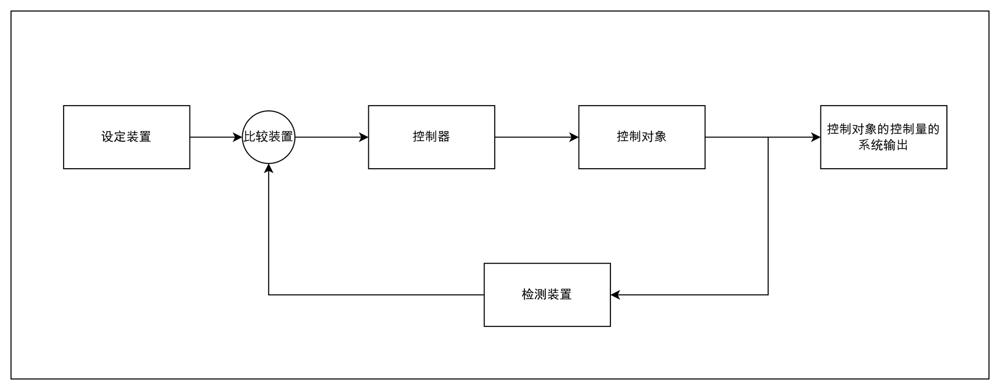

## 一、什么是控制？

曾经有个学弟问过我一个问题，到底什么是控制，控制和嵌入式之间是什么关系，当时我是这么回答他的，控制是一种研究如何让系统稳定起来的一种理论，也可以说是算法，而嵌入式是应用控制理论的一种方式。

## 二、控制理论的初步认识

### 2.1 以水温控制为例，认识控制的世界
当我们对控制理论有了一个最基本的理解，现在我们开始思考我们为什么要研究控制理论？，以一个实际工程问题为例，来解释这个问题。

以烧水为例，目标是将水烧到100度，众所周知，水的沸点是100摄氏度，那我们想实现这个目标很简单，一直加热一直烧，水沸腾了就ok了，这个对于各位来讲实现起来是比较简单，因为物理学定律告诉我们，水烧到100摄氏度温度就上不去了。
我们实现了100度沸水的目标，现在我们把难度提升还是烧水，目标是烧到70摄氏度，并且保持这个温度实现保温。这个怎么实现？

第一个方法一直烧，如果我们通过物理学分析掌握了整个加热装置的热力学方程，掌握了加热器加热功率与水温的物理学关系，那么我们就可以实现烧到70的这个目标。这个方案理论可行，但是在实际工程应用上有很大的缺陷，建立的物理学模型与真实系统是有差异。导致同等系统输入的情况下实际系统输出与理论输出存在误差。导致控制精度不佳。

方案二，我们增加一个测温装置，通过测温装置建立一个闭环的反馈控制系统，编写一个适当的控制程序，比如由简单的if else来实现的开关温度控制，但是效果并不是很好。
方案三，上述由简单的开关实现的温度控制，控制效果差无法满足一个较高的精度需求，为此我们改变控制方法，改进控制方式，从一开始的简单的开关控制变为，相对来讲更高级的比例控制，通过比较设定温度与当前温度的一个差值，来设置控制量，效果如下，控制温度效果肯能会相对来讲要好一点。

### 2.2 对控制的认识

回顾上述三个方案，我们开始总结上述所讲的例子，100摄氏度很容易达到，没有任何难度，一直烧就行，70摄氏度有点麻烦，需要搞点操作，方案一找到物理规律，按照物理规矩进行加热，方案二三，加个测温装置，根据反馈值，来实现对水温的控制。方案二三相较于一引入了反馈，控制器自身根据反馈值，自动的实现对水温的控制更加高效，在我们控制理论中，我们称方案二三，这种引入反馈检测装置的系统，称之为**闭环控制系统**，而方案一这种系统称之为**开环控制系统**，在控制理论中我们更多的是研究闭环控制系统。

当我们认识了开环与闭环控制的基本概念，我们开始分析控制系统的基本结构，控制系统的基本结构如上图所示，有设定装置，用于设定系统控制目标输出。有比较装置用于计算系统当前值与设定值之间的误差关系，有控制器用于分析系统的比较误差输出，根据误差设定控制量作用于控制对象也就是系统本身，以上就是一个控制系统的基本结构。

现在我们明确了控制系统的基本结构，那么现在我开始思考一个问题，那控制到底是干啥的？控制理论这门学科到底研究了什么东西。如上图，控制说到底，就是首先对系统进行分析，建立数学模型，建立数学模型以后分析系统的数学模型，根据数学模型获得系统在时域上的系统的输入输出关系，然后根据系统的输入输出关系，设计控制装置，优化系统自身的数学模型，然后再次分析，控制器再次设计，最终到达一个较为满足的系统状态。回顾上述内容，然后再次思考我们控制理论到底研究啥了？内容一**数学建模**，内容二**系统数学模型分析**，内容三**控制器的设计**。核心内容在我看来，是系统的分析，或者说**系统的时域响应、系统数学模型和系统输入之间的关系**。**我们只要研究明白三者的数学关系，那我们就可以设计控制装置，通过改变系统的数学模型，优化系统，到达一个优异的控制状态。**

## 三、系统的输入输出与卷积

### 3.1 从一个典型的机械系统入手

如上图一个经典弹簧质量阻尼系统，系统的输入为f(t)，输出为x，即弹簧的相对初始位置的位移，对系统进行力学分析，建立系统的微分方程。系统力学分析如下图所示。

系统受到弹簧的弹力，大小为
$$ f_k(t) = k  x(t) $$
受到了来自阻尼器的阻尼力，大小为
$$ f_b(t) = b \frac{dx(t)}{dt}$$
由牛顿第二定律
$$ F = ma $$
得系统整体的微分方程为
$$ f(t) - f_k(t) - f_b(t) = ma $$
根据以上公式得
$$ f(t) - kx(t) - b \frac{dx(t)}{dt} = m \frac{d^2 x(t)}{dt^2}$$
对方程进行整理得，整理方式为将输出放在左侧，将输入放在右侧，得
$$ m \frac{d^2x(t)}{dt^2} + b \frac{dx(t)}{dt} + kx(t) = f(x) $$
这个就是系统的微分方程我们可以通过高等数学中微积分学到的方法求解上述微分方程的解$x(t)$即系统的输出，但我们求解完系统输出后我们可以明确系统的输出特性，明确系统是否稳定。

通过经典的数学分析，对动态系统的微分方程进行求解的方式，对于处理系统时域分析，有点不大直观，感觉系统的输入与输出之前的传递关系非常的奇怪。感觉信号与系统之间的传递关系感觉没有那么直观。信号进入系统，系统到底是对信号干了什么，用传统数学分析的方法是难以清晰的认知。感觉分析系统的通畅性极低。这时候卷积为我们提供了新的系统输出分析方式，让我们更直观的理解信号与系统之间的关系。

### 3.2 线性时不变系统的定义

在我们讲解卷积之前我们先明确什么是**线性时不变系统(LTI)**。什么是线性，线性为系统输入输出满足**叠加原理**的系统，用数学公式表示为。
$$ax_1(t) + bx_2(t) = ay_1(t) + by_2(t)$$
图像表示为

两个输入信号输入一个是1，一个是2。系统的输出等幅增大，系统总体输出叠加。
时不变性为系统输入发生时间延迟，输出性质不变，用数学表示为
$$ x(t) = y(t) \\ x(t - \tau) = y(t - \tau)$$
用图像表示为
，左侧为系统输出右侧为系统输入，系统输入发生了延时，系统的输出延时，但是输出特性不变。

### 3.3 初识卷积

卷积这个词我从大一听到现在，大一的我听到这个词语是从深度学习中听到的，大二的我听到这个词语是从《信号分析与处理》听到的，现在的我听到这个词语是从控制理论中。大一的时候我刚听到这个词语觉得很炫，当时的我理解不了这个词是什么意思，也无法理解他到底是做什么的。但是到大二大三之后我对这个词有个真正的认识，以下是我对卷积这种数学运算的理解。

对卷积的理解，我最喜欢并且我感觉最形象的是DR_CAN老师在《控制之美》中的解释，如下图他以水面的涟漪为例，解释卷积运算。系统输入为向水面丢石子，系统为水面，系统输出为水面涟漪，多次向水面系统输入，产生水面的叠加为卷积，这个比喻在我看来非常的形象。

### 3.4 卷积定理的分析

如上图左侧为系统输出，右侧为系统输入。系统输入一个数值，系统会产生对应的系统响应。根据线性时不变系统的特性，我们将系统响应叠加到一起得到了上图黑色的部分。现在我们看下图

我们可以明确的从图中看到黑色系统响应曲线是有系统其他曲线叠加到一起形成的。黑色曲线的大小为
$$ x_{黑色}(t) = x_{红色}(t) + x_{黄色}(t) + x_{紫色}(t) $$
或
$$ x_{黑色}(t) = x(t) + x(t - \Delta T) + x(t - 2\Delta T) $$
我们将公式推广，按照红色、黄色、黑色曲线的时滞特性，增加响应曲线的数量，可以推导出
$$ x_{黑色}(t) = \sum\limits_{i=0}^{n}Ax_{other}(t - i \Delta T)$$
其中A为系统输出响应的幅值。
我们做进一步处理
$$ x_{黑色}(t) = \lim_{\Delta T \to 0} \sum\limits_{i=0}^{n}Ax_{other}(t - i \Delta T) $$
使时间间隔趋向于零，相当于系统的输出是对系统连续时间下的x(t)进行叠加，等价于连续条件下的积分关系。
$$ \lim_{\Delta T \to 0} \sum\limits_{i=0}^{n} \Rightarrow \int_{0}^{t}  \\ \Delta T \Rightarrow d\tau \\ i \Delta T \Rightarrow \tau$$

现在引入一个概念**冲激函数**，其定义如下
$$
\begin{equation}
\delta(x)=\left\{
	\begin{aligned}
	\infty \quad t=0\\
	0 \quad t \neq 0\\
	\end{aligned}
	\right
	.
\end{equation}
$$
并且冲激函数的积分值为1，
$$
 \int_{-\infty}^{+\infty}\delta(t)dt = 1
$$

我们可以将其想象成如上图所示的矩形，宽度为$\Delta T$，高度为$\frac{1}{\Delta T}$，当我们让$\Delta T \rightarrow 0$，那高度$\frac{1}{\Delta T} \rightarrow \infty$，即如下图所示，该图即为冲激函数的图像

根据上述内容我们继续研究冲激函数的性质，冲激函数在0时刻的数值等于冲激函数积分，也可以说冲激函数的面积，即当前时刻的冲激值等于冲激函数的面积，即
$$\int_{-\infty}^{+\infty}A\delta(t)dt = A \\ A = 冲激函数的面积$$

我们将继续分析最开始的问题，分析最开始的图像，我们引入冲激函数将公式继续推广。
$$ x(t) = \lim_{\Delta T \to 0} \sum\limits_{i=0}^{n}Ax_{other}(t - i \Delta T) $$
我们将系统的输入从一开始的方波信号转化为脉冲信息，将系统输入变为间隔时间$\Delta t \rightarrow 0$的脉冲

$x_other(t - i\Delta T)$进而转化为冲激函数$\delta(t)$的响应函数$h(t)$，即**系统的脉冲响应**，
继续推导公式
$$ x(t) = \lim_{\Delta T \to 0} \sum\limits_{i=0}^{n}Ah(t - i \Delta T) $$
由上对冲激函数的研究得到，当前时刻的冲激值等于冲激函数的面积
$$\int_{-\infty}^{+\infty}A\delta(t)dt = A \\ A = 冲激函数的面积$$
我们根据以上性质对系统输入的每一个时刻的脉冲进行分析

如上图，得到A的值为
$$ A = \Delta T f(i\Delta T)$$
综合上述分析得
$$ x(t) = \lim_{\Delta T \to 0} \sum\limits_{i=0}^{n}\Delta T f(i\Delta T)h(t - i \Delta T) $$
我们对该公式进行连续化将公式进行如下方式进行处理
$$ \lim_{\Delta T \to 0} \sum\limits_{i=0}^{n} \Rightarrow \int_{0}^{t}  \\ \Delta T \Rightarrow d\tau \\ i \Delta T \Rightarrow \tau$$
得到
$$x(t) = \int_{0}^{t} f(\tau) h(t-\tau)d\tau $$
进而得到卷积公式的定义
$$ f(t) * h(t) = \int_{0}^{t} f(\tau) h(t-\tau)d\tau$$

进而我们可以通过卷积通过系统的冲激响应以及输入信号获得系统的输出。

