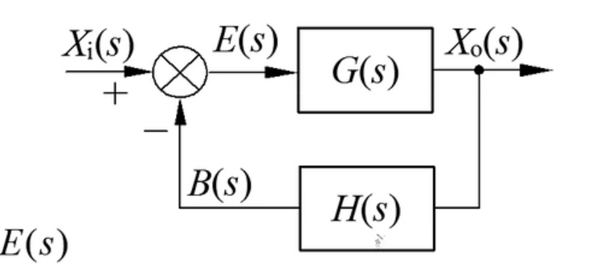

# 现代控制理论

## 绪论

### 控制理论的性质

#### 控制理论的两个目标

1.  了解基本的控制原理；
2.  以数学表达他们，是它们最终能以计算进入系统的控制输入，或用以设计自动控制系统。

#### 两个主题

自动控制领域中有两个不同的但又相互联系的主题。

第一个主题：反馈的概念。  
第二个主题：最优控制的概念。

反馈概括了很广泛的概念，包括

1.  多回路反馈
2.  非线性反馈
3.  自适应反馈
4.  智能反馈

### 控制一个动态系统的几个基本步骤

1.  建模
2.  系统辨识
3.  信号处理
4.  综合控制输入

## 控制系统的空间表达式

### 1.1状态变量及状态空间表达式

#### 1.1.1 状态变量

概念：一组变量  
其特点为，足以完全确定系统的运动状态，且个数又是最小。  
满足足以完全确定系统的运动状态，且个数又是最下的**一组变量**中的**一个**称为**状态变量**。一组状态变量有很多状态变量组成。

#### 1.1.2 状态矢量

如果$n$个状态变量用$x_1(t), x_2(t), x_3(t), ……, x_n(t)$表示，并把这些状态变量看作式矢量$x(t)$的分量，则$x(t)$就称为状态矢量，记作：

$$
x(t) =
\begin{pmatrix}
x_1(t)\\
x_2(t)\\
\vdots\\
x_3(t)
\end{pmatrix} 或 
x^T(t) =
\begin{pmatrix}
x_1(t), x_2(t), \cdots,x_n(t)
\end{pmatrix}
$$

#### 状态空间

以状态变量$x_1(t), x_2(t),\cdots, x_n(t)$为坐标轴所构成的n维空间，成为状态空间。

#### 状态方程

由系统的状态变量构成的一阶微分方程组称为系统的状态方程。

$$
x' = Ax + bu
$$

$A$表示系统矩阵，$b$表示输入矩阵或控制矩阵，在控制系统中控制对象为$u$，所以称$b$为控制矩阵。

#### 输出方程

在指定系统输出的情况下，该输出与状态变量间的函数关系式，称为系统的输出方程。

#### 状态空间表达式

$G(s)$前向通道传递函数，$H(S)$反馈函数的传递函数，闭环传递函数为

#### 从系统机制出发建立状态空间表达式

常见控制系统

1.  电气系统
2.  机电系统
3.  热力系统
4.  机械系统
5.  气动液压系统

按照其物理规律，即可建立系统状态方程。

1.  电容 $i_c' = C u_c'$
2.  电感 $ u\_c = Li\_c’$
3.  直流电机

纯电容回路：仅有电容和电压源组成的回路。  
纯电感割集：仅有电感和电流源组成的割集。

### 状态变量及状态空间表达式的建立

实现问题  
将输入输出动态关系表达式的运动方程和传递函数转化为**状态空间表达式**

状态空间表达式

$$
x' = Ax + bu
$$

$$
y = cx + du
$$

应该指出：**从传递函数求得的状态空间表达式并不是唯一的**。其中$A、b、c、d$可以取无穷多种形式，**这就是所谓的实现的唯一性**。

尽管实现是非唯一的，但\*\*只要原系统的传递函数中分子分母没有公因子，既不出现零点对消，\*\*\*\*则$n$阶系统必有n个独立的状态变量，必有$n$个一阶微分方程一直等效，\*\*系统矩阵A的元素气质虽然各有不同，单机为一个系统实现，**其特征根必是相同的。**

通常把