#! https://zhuanlan.zhihu.com/p/540630741

# Linux基础 —— 命令

## Linux基本命令

### ls命令（-l -a -i -d -R）

**ls**显示当前目录（文件夹）下的文件，如图所示。

#### **-l选项**，显示当前目录下的文件部分属性信息

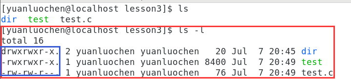

相较于上图文件信息增加了文件属性信息，在蓝色框内，以 **d**开头为目录（文件夹），以 **-**开头的普通文件。

并且可以将 **ls -l** 简写成 **ll**

#### **-a选项**，显示当前目录下的所有文件，包含隐藏文件（以 **.** 开头的文件）

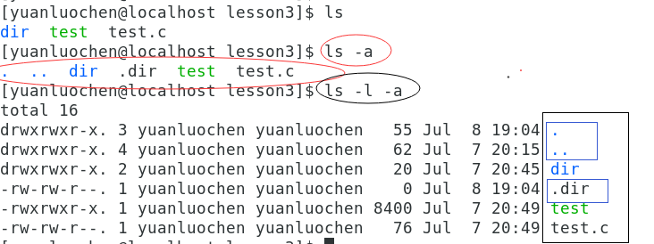

 **.** 为当前目录， **..** 为上级目录， **.dir**为隐藏文件dir。

命令的选项可以单独与与命令使用，也可以同时使用，就如本图所示 **-l -a**连用不仅显示了隐藏文件，也显示了文件的详细信息。也可以将 **-l -a**简写成 **-la**效果相同。

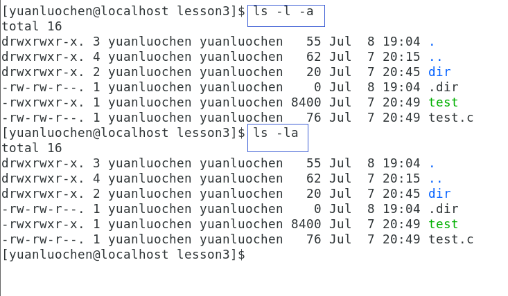

#### **-i选项**，显示当前文件的inode编号

当我第一次看到inode这个词语时我产生了好奇，inode编号是什么？他的作用是什么？我来一一回答这个问题。

首先我们先要知道什么是inode编号，它在哪里？

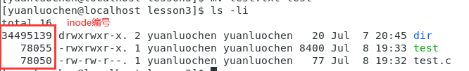

在理解inode之前，首先我们要记住一点 **在Linux系统中一切皆文件** ，在Windows系统中，利用 **文件名+后缀**这一方式来标识文件，即文件是谁用文件名来标识，是什么类型的文件用文件后缀来标识。而在Linux系统中则不同，在系统层，标识文件是通过inode编号来标识文件，在Linux系统中，文件名+后缀只是用于给用户来看的。系统并不识别这一形式。

只讲理论，难以让人理解，以下进行详细的解释

1. 首先生成一个可执行性文件test  
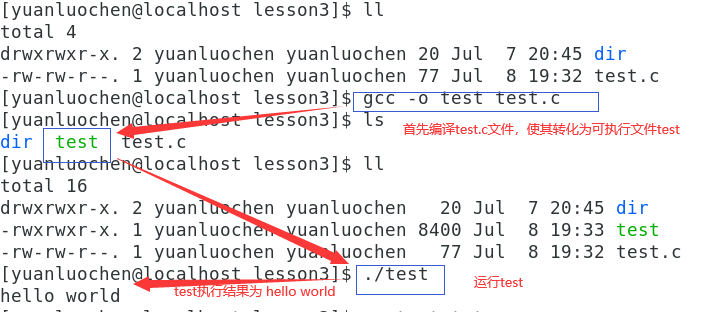
2. 将可执行文件test进行更名为test.txt
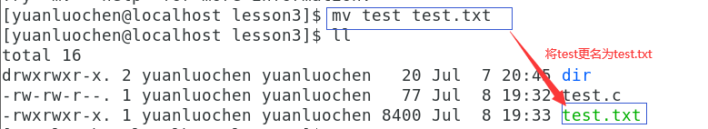
在Windows系统中将可执行性文件（.exe）更名为文本文件（.txt），文件不可执行，而在Linux系统中则可执行。
3. 执行test的更名文件test.txt
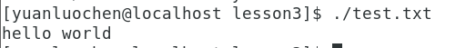
文件的inode编号不变，文件的类型改变了
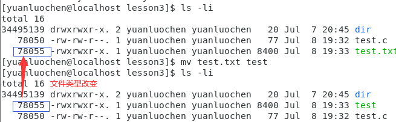
文件依旧可如同可执行文件一样执行。

这表明在Linux系统中文件利用inode标号来进行标识的，只要inode编号不变，文件的类型就不变。

#### **-d选项**，显示文件本身文件名，但不显示其属性信息

默认状态下 **ls -d**为显示当前目录，如下图所示

若在 **ls -d** 后加特定文件名，即**ls -d 文件名**显示指定文件，如下图

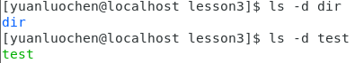

#### **-R选项**，显示当前目录下的子文件

如下图

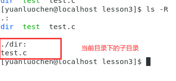

### pwd命令

**pwd** 命令：显示当前所处的绝对路径（当前位置），如下图

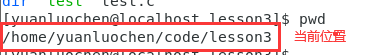

那么什么是绝对路径，我产生了好奇，在理解绝对路径之前，我们先要明确如何在Linux系统中定位文件，在明确以上问题我们先要理解一个符号 **/**

符号 **/** 在Linux系统中有两种含义

1. 路径分隔符，Linux为 **/**， Windows为 **\\**
2. 根目录
  
当我们明确 **/** 的含义时我们就要开始理解 **绝对路径** 这一概念。以一条路径为例

**/user/code/test.c**在这条路径中除了首个 **/** 为 **根目录** 外，其余皆为 **路径分隔符** 。那么为什么通过这种方式来定位文件？

在现代，大多数操作系统组织文件的方式都是树形结构，及如下图所示

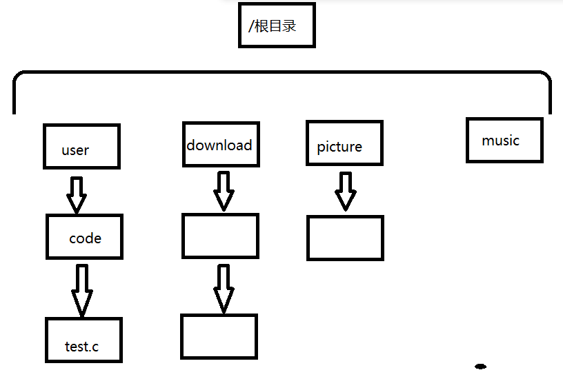

这种组织文件的方式使从根目录到目标文件的路径具有了唯一性。因为若要定位test.c文件，test.c文件的上级目录只能为code文件，code文件的上级目录仅能为user文件，user文件的上级目录仅能为根目录。由此从根目录到test.c的路径具有唯一性，我们称这条路径为 **绝对路径**。

有绝对路径，那么也必有 **相对路径** ，相对路径是什么，相对路径是从某一文件（不包括根目录）开始（默认状态下，从当前目录下开始），到目标文件的路径。此路径不具有唯一性。

仍以定位test.c文件为例，利用相对路径来定位test.c文件。

1. 从code文件开始，定位test.c文件，其相对路径为 **test**（ **.** 为当前路径, **/** 为路径分隔符）
2. 从download文件开始，定位test.c文件，其相对路径为 **../user/code/test.c**( **..**为上级目录 )

### cd命令

cd命令：切换路径（或进入某文件）

cd 后可接相对路径，也可接绝对路径，其两者效果相同，如下图

cd后接相对路径
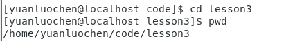
cd后接绝对路径  

cd命令的快捷方式

1. 进入当前用户的主工作目录： **cd ~**
   **~**表示当前用户的主工作目录
2. 回到上一次的路径： **cd -**
   **-**表示当前所处路径的上一次路径

### touch命令

touch命令：创建新文件（不包括目录）或修改文件时间到当前时间

修改文件的时间

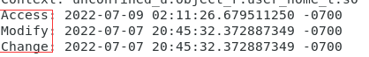

见上图这是文件的三类时间，那么这三类时间有何区别

Access 是文件的读取时间

Modify 是对文件内容的修改时间

Change 是对文件属性的修改时间

这里我们思考一个问题，什么是文件？  
**文件是文件内容与文件属性的总和**文件内容是数据，文件属性也是数据。件属性并非为文件的内容，反之，亦然。

上述三种时间，第一个Access很好理解，是文件读取时间。而Modify 与 Change 却并不好理解。其二者皆为更改文件的时间。但文件是内容与属性的总和，其二者，各更改文件的其中一部分。

### mkdir命令

mkdir：创建新目录

mkdir默认只可创建一个目录，如果想创建一串路径，则需要加入一个选项 **-p** 。

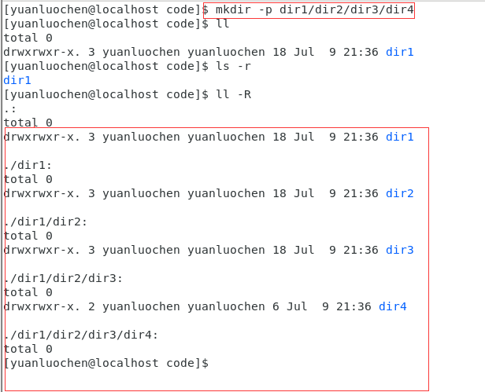

### rmdir命令

rmdir：删除空目录

那么如何删除非空目录呢？

在讲pwd命令时，就说到一个概念，在Linux系统中组织文件的形式为树形结构。想象一下，删除一个非空文件，相当于截断大树的一个树茎，mkdir仅可截断大树的树叶，若想截断数茎，必须先删除其子目录，递归式的删除文件，直至要删除的目录为空时，在删除该目录。这样比较麻烦。这时我们可以用命令 **rm -r 命令递归式的删除目录** 。

### rm命令（类似于 delete 删除）

rm（不带选项）：删除普通文件

#### rm -r ：递归删除目录（可删除空目录）

**-r**递归式的处理

#### rm -f ：强制删除超级用户所创建的文件

**-f**（force 强制）对其他用户所创建的文件进行强制处理

### sudo命令

sudo：提升权限

在使用某命令前加sudo提升权限，使用超级用户root来执行命令。超级用户root创建的文件可被普通用户删除

但普通用户删除超级用户文件，需要被提醒，如下图

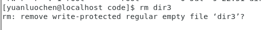
若想删除输入 y ；不想删除输入 n

若想跳过提醒强制删除，则用 **rm -f** 命令进行删除

### 通配符 *

匹配含有相同字符的文件

以图为例

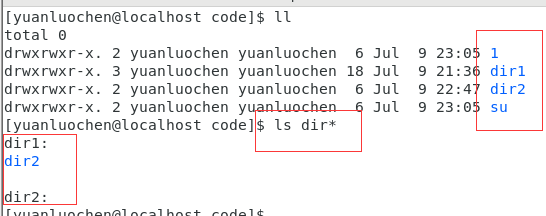

原目录下有四个文件有两个含有dir字符的文件

当在ls 命令后加 **dir***则仅显示了在该目录下及其子文件中含有dir字符的文件

利用通配符也可批量删除有相同字符文件名的文件，如下图

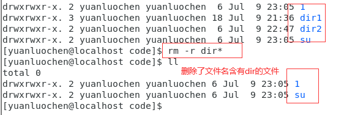

### man指令

查找命令、系统调用、库函数……的说明，如下图查找rm命令的说明

回车之后，就会显示说明

当我们输入命令 **man man** 即查找man的说明我们发现 man 命令查找时有多个接口，如下图。
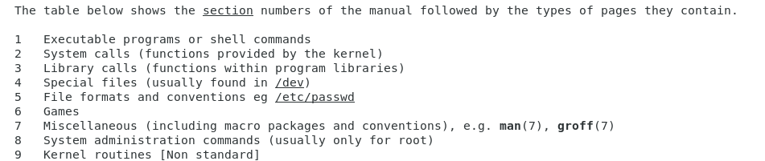

接口1，为命令接口；接口2，为系统调用接口；接口3，为库函数接口……，当想要查找库函数 printf 时我们可以输入 **man 3 printf** 这样就可让man命令在3号库函数接口中查找printf函数

搜索 **/ + 搜索内容**

退出 **q**

### cp命令（类似于 copy and paste 拷贝和粘贴）

cp（copy）：拷贝文件到指定路径之下。若不指定拷贝到的路径，默认为当前路径，但拷贝到当前路径需要对文件进行更名（更名时要于当前路径下的文件名不发生冲突）。其具体使用方式如下图

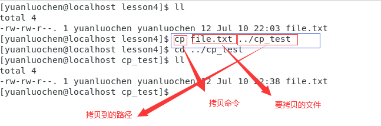

首先要明确一点，在同一个目录下，文件间的文件名是不可冲突的，若是拷贝文件到当前目录且不重命名，则会报错，如下图

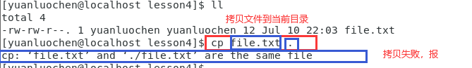

这时，若实在需要拷贝文件到原目录，则需对文件进行重命名。如下图所示。

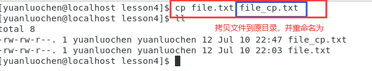

#### **-r**选项，对文件进行递归式的拷贝（主要针对拷贝目录）

若想拷贝目录，需要如同删除目录时一样（rm -r），对文件进行递归式拷贝 **cp -r**，即先拷贝其子目录，再一步步向上级文件进行拷贝。

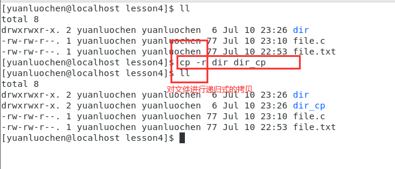

#### **-f**选项，强制拷贝文件

**cp -f** 强制拷贝文件

### cat命令

cat：查找目标文件的内容

如下图

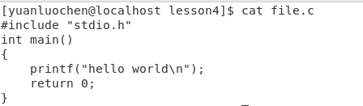

#### -n选项，表示行号

如下图

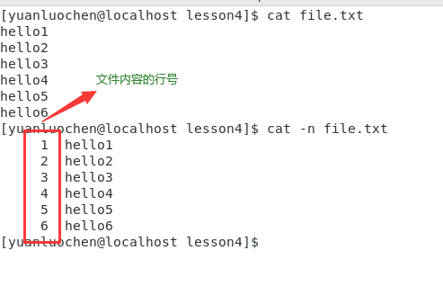

### tac命令

tac：相反于 **cat**命令方向查找文件内容，如下图

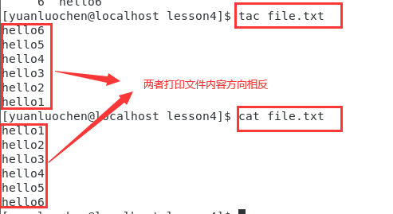

选项的使用与cat命令相同。

### chown命令

chown：更改文件的拥有者

### mv命令（相当 **剪切** 和 **重命名**）

mv：（全称move）移动存储

#### **mv**用于剪切文件

如下图，利用mv命令将文件剪切到目标目录

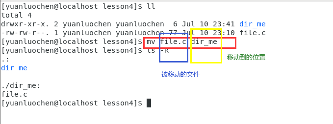

#### **mv**用于对文件进行重命名

##### 重命名普通文件

如下图

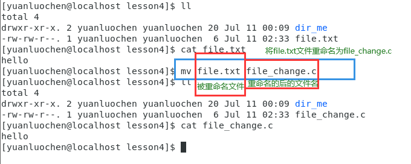

其原理十分简单，系统先创建一有您命名的新文件，将原文件的数据移动到新创建的文件，由此实现文件的重命名。

##### 重命名目录

重命名目录（文件夹），不需要像rm（删除），cp（拷贝）一样使用 **-r** 选项。

#### -f选项，若移动目标文件存在，则不会询问直接覆盖直接覆盖

#### -i选项，若移动目标文件存在，则会询问是否覆盖

### alias命令

alias： 对文件进行重命名（类似于C语言的 **define** ），如下图

将 **ls -a -d**重命名为 **mycmd**

### which命令

which：显示命令的完整路径，显示命令的别名（别名可理解为经历alias命令重命名的后的命令名）

如下

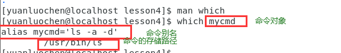

### date命令

date：查看系统时间

如下图，直接输入date

#### 以设定格式输出系统时间

但是这种时间，并非很好辨认，为此，我们需要对时间的输出进行设置，如下图

1. 输出年月日
   如图所示
   
   在图中输出时间的固定格式为 **date +%** 切记加号与date之间必须要有空格
   **%Y**为输出年 **%m**代表输出月 **%d**代表输出日（Y、m、d需要区分大小写），“/”可以由自己随意更改，无具体格式
2. 输出时分秒
   如图所示
   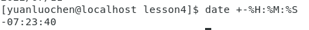
   在加号后侧必须要加一个 **-**，如果不加则会输出不符合需求
   **%H**是小时 **%M**是分钟 **%S**是秒，与上等同 “：”可随意更改
此上输出的系统时间，是由时间戳转化而来的

#### 时间戳

输出时间戳 **date +%s**

### cal命令

cal：查看日历信息

可以直接输入 cal命令：查看当前的日历

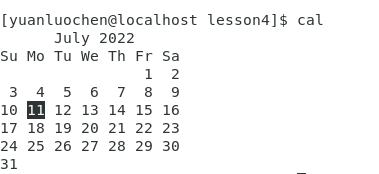

也可以输入 **cal 年份**查看该年份的日历信息

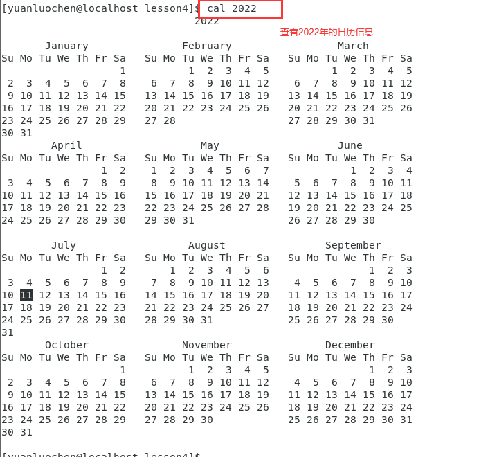

也可以查看本月的日历信息

输入命令 **cal -1**

查看上一个月，本月，下一月共三个月的日历信息

输入命令 **cal -3**

### top命令（类似与windows的任务管理器）

直接输入 **top**

退出，输入 **q**

### 检测是否联网

#### ping命令

ping 网址

1. 如图

   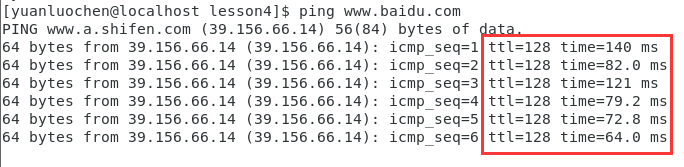

   若有方块内两项有时间，则证明联网

2. 或输入一个不存在的网址，如下图

   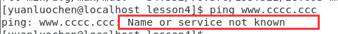
   若出现红框内的报错则证明联网。

**ctrl + c**退出

也可以限定次数，更改命令为 **ping -c3 www.baidu.com**  
-c3限定三次

#### ifconfig命令（类似于Windows "ipconfig"）

ifconfig:查看计算机的网络信息

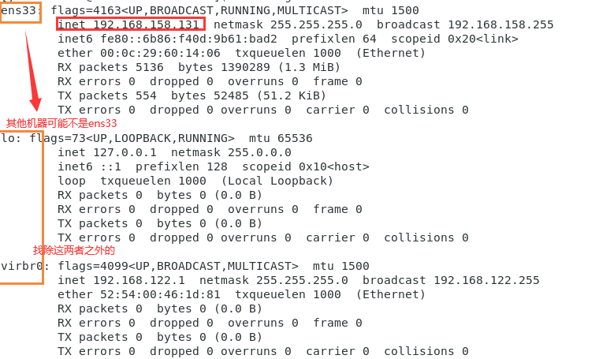

查看inet是否有地址，若无，则继续

输入命令 **sudo（若权限允许可不加） ifup ens33（与上图网络接口对应，其他机器可能不是ens33，可能为其他）**，如图

### shutdown 关机命令

shutdown [选项]

#### -h选项 将系统服务停掉后 **'立刻关机'**

#### -r选项 在系统服务停掉后 **'重新启动'**

#### -t选项 设定固定秒数后关机

shutdown -t sec  
sec为设置的秒数，如图

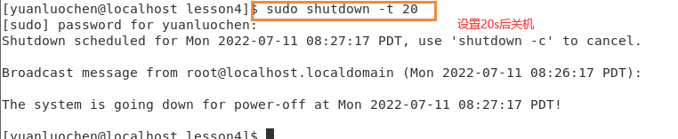

### su 切换用户

命令**su （-） 用户名**，括号内的 **-**若存在切换用户时，同时切换到对应用户的工作目录，详细如下。

1. 切换至高级用户root
   1. 输入命令 **su root**，如下图
   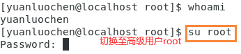
   2. 输入命令 **su**
2. 切换至普通用户
   输入命令 **su 普通用户名**

### 热键

Tab ：命令补全，档案补齐 （按两次自动匹配以输入字符开头的命令）

ctrl + c 让当前程序停掉

ctrl + d 类似于 **exit** 回退到上一次的用户，若无则退出登录

### passwd 改密码

更改 **当前用户** 的密码
