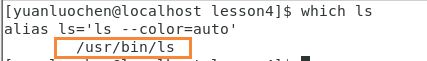

#! https://zhuanlan.zhihu.com/p/541935830
# Linux基础 —— 系统

linux系统根目录 / 的目录结构是有标准的 **FHS** ，这个标准规定了根目录下各个目录都有其特定功能。

## 数据重定向

更改程序的输入输出

大部分计算机，都要默认打开三种设备（由于在Linux系统中一切皆文件，所以在Linux系统中，也可以认为默认打开三种文件）

1. 标准输入 stdin  代码 0 （可理解为键盘）
2. 标准输出 stdout 代码 1 （可理解为屏幕）
3. 标准错误 stderr 代码 2

<!-- 以上代码（0 、1、2）为类型为FILE*类型的结构体 （个人猜测）-->

### 输出重定向 >

输出重定向特点：

1. 写入到指定文件
2. 覆盖式写入
   覆盖：清空原来数据，写入新数据。
3. **>**（输出重定向）只重定向标准输出

显示输出信息输出不仅输出标准输出（stdin），也输出标准错误（stderr），而重定向输出（**>**）仅重定向标准输出。

补充

**>** 默认情况下重定向标准输出（stdout 代码为1）
**2>** 重定向标准错误（stderr 代码为2），保留标准输出（stdout）

由将stderr重定向到stdout **2>&1**可知是将数据重定向到文件的地址(或者是设备的地址)

### 追加重定向 >>

会在文件末尾，追加内容，不同于输出重定向，覆盖式的写入。

### 输入重定向 <

作用：将文件打开，作为程序的数据源。

### cat指令追加

cat指令内容追加

在终端中，仅输入cat指令，其cat指令的输入为标准数据流（stdin）即键盘输入，其输出默认为标准输出流（stdout）即屏幕。

可以利用重定向更改cat指令的输入输出源为文件内容数据

### /dev/null

若数据写入 **/dev/null** 这个路径数据会被系统直接清除

## Linux管道

管道：在计算机系统中是用来数据传输的。

**cmd1（msg_src）| cmd2**cmd1命令产生的数据经过管道（**|**）被cmd2经过处理，处理后输出被管道处理过的数据

### 补充命令grep

按照行为单位进行关键字过滤

使用命令格式**grep 关键字**

### wc

统计行数 **wc -l**

## 环境变量与PATH

首先，**在Linux系统中，命令、程序、工具都可以统称为可执行程序**由此可推断出一点，自己编写的程序与命令在本质上是相同的，那么为什么在终端中只要输入命令名称，命令就可以执行，而我们自己编写的一个可执行程序，输入程序文件名，却报错，如下图

首先我们先要思考一条命令如何执行，首先找到命令所在的路径，然后执行该命令。那么我们自己编写的程序是如何执行的呢？我们输入编写程序所在的路径，然后回车执行程序，由上我们可以明显的明白一个问题——程序与命令本质上都是可执行程序，但是为什么命令可以做到不输入其地址就可执行。

以一个常见的命令 **ls** 为例，通过利用 **which** 命令查找出其命令的路径为 **/user/bin/ls**

在系统中，可执行程序的 **搜索路径** 保存在一个 **全局** 变量中——PATH，它给系统提供命令的搜索路径，是环境变量的一种。

**./mycmd** 其中 **.** 表示当前目录，**/** 表示路径分隔符其总体表示表示当前目录下的mycmd程序，输入 **./mycmd** 实质上，是为了让系统知道可执行程序所在，进而运行程序。

查看环境变量 **echo $PATH**

全局变量PATH中保存了可执行程序的搜索路径，其作用为系统提供了命令的搜索路径

PATH：从左到右依次进行搜索，一个路径下找不到可执行程序所在的路径，再搜索下一条路径，若找到，则停止，若找不到，则报错（command not found！）。

PATH保存了多条路径路径之间用 **：** 隔开

让程序如同命令一般运行的方法

1. 将程序拷贝到PATH内的搜索路径某一个路径中。
安装的本质，将二进制可执行程序拷贝到系统环境变量之中
2. 追加环境变量，**export PATH=$PATH:路径**

由上我们发现 **系统本身会提供某种全局查找属性，帮我们找到特定的模块/程序**
