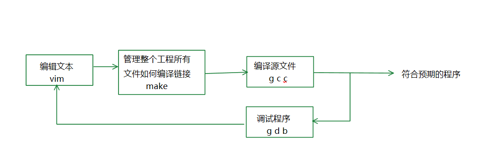
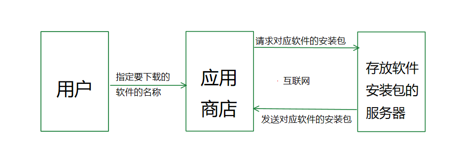
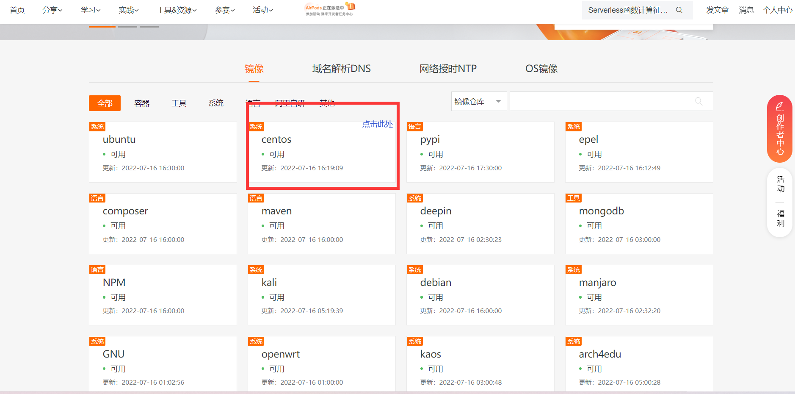
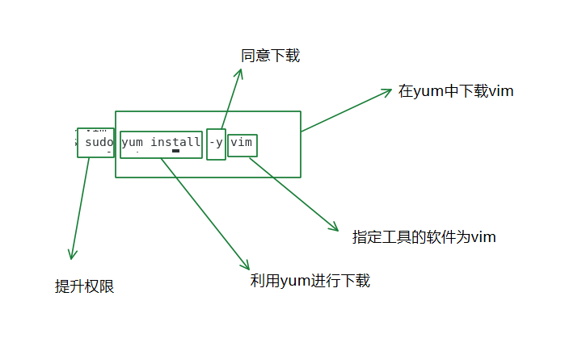
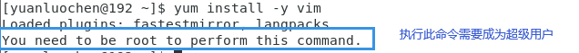
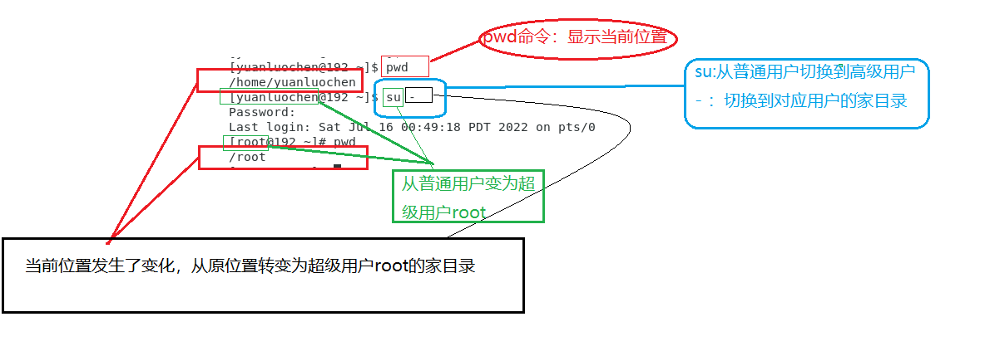
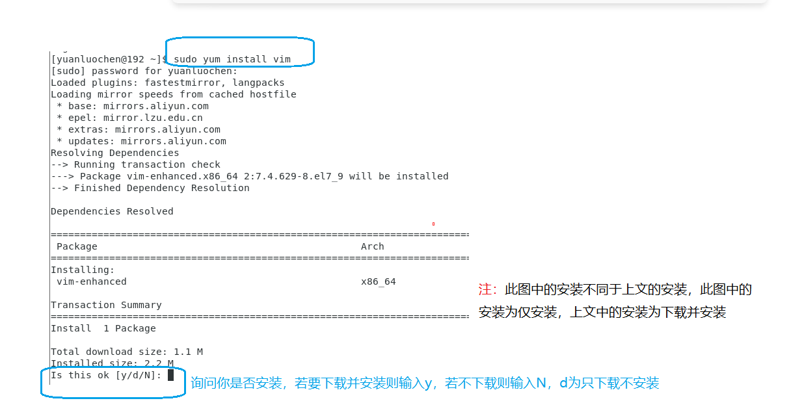
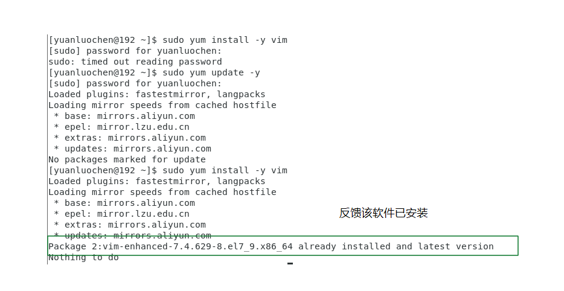
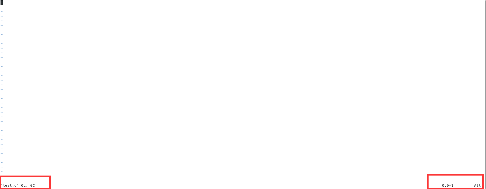

# 在Linux系统中实现高效编程 —— 浅谈vim，makefile，gdb的使用

在下非计算机专业的学子，能力有限，文章内容皆来源于学习所得，内容恐有疏漏，欢迎各位读者批评指正。

## 前言

众所周知，如果想编写一个程序，我们首先需要 **编写** 一个源文件(如.c文件)，将源文件通过 **翻译(编译)** 生成可执行文件，有时在翻译文件过程中，会出现或多或少的bug，这时我们需要对程序进行 **调试**，经过多次调试，最终程序所有bug全部消失，程序的一切都符合我们的想法来运行，此时我们就完成了程序的编写。

所以，一个符合我们预期的程序的制作需要三个过程：**编写、翻译以及调试**。

在Windows系统中，有众多集成开发环境(IDE)如：Visual Studio、PyCharm。这些集成开发环境让程序的制作的三个过程可以一笔带过。而在Linux系统中，虽然也可以使用一些IDE，让开发变得更加轻松。但是为了提升自我能力建议使用vim，make，gcc以及gdb对程序进行编写、翻译以及调试，以下我来介绍一下，以上三种工具的使用。

## 在Linux系统中，安装工具的方法

**注**：(**此文内的安装若无特殊说明，皆为下载并安装**)以下操作皆在CentOS7系统下完成，以下操作可能在其他基于Linux内核的操作系统中可能并不适用。建议可以通过查找官方文档或一些优秀博客，以此来进行以下操作

### yum源的介绍(CentOS7系统)

我们在智能手机内下载软件，有很多都是在手机内置的软件商店中下载的，而在Linux系统中也有类似的工具。在CentOS7内对应的工具为 **yum**，它是一款软件包管理器，它可以对软件进行安装(install)，卸载(remove)，以及更新(update)。

具体的介绍可以在终端中输入命令 **man yum** 来查找yum的具体内容

**注**：**man + 命令名称** 为查找该命令的具体说明

### CentOS7更换本地yum源

为什么要更换本地yum源，首先我们要理解yum是如何下载一款软件的。将一款软件安装的自己的计算机需要软件的安装包(package)，那么软件的安装包如何获取，从应用商店上下载，那么问题来，应用商店的安装包从哪里来？在应用商店里。这个答案很模糊，很微妙，感觉是对了，但总觉得哪里有点问题。如果在应用商店里，那么就表明软件在计算机内部，那如果本来就在计算机内部，那么我们为什么要再下载一遍呢，那不就是多此一举吗。这个答案怎么想也不对。正确的答案是，软件包在对应的服务器里。

用户选择要下载的软件包，应用商店通过互联网向服务器发出请求，服务器将软件包发送给当前用户的计算机，这时计算机就获得了软件包。
所以软件的下载需要通过互联网来连接国外的一些服务器，下载速度可能有些缓慢，所以建议将yum源更换为本地的镜像
**注**：这一部分的阐述可能有误。

#### 更换本地yum源的具体方法

以下以将yum源为配置阿里镜像为例

首先进入[阿里巴巴开源镜像站](https://developer.aliyun.com/mirror/阿里巴巴开源镜像站)

其内有详细的配置方式

### 工具的安装、卸载以及更新

我们介绍了yum，这时我们就可以通过yum来下载工具，我们用vim的安装为例

输入命令 **sudo yum install -y vim**

我们来解析一下这条命令：

**sudo**命令为提升权限，从普通用户提升到超级用户root，在Linux系统中普通用户正常来讲是没有权限下载软件的，若以普通用户且不提升权限的情况下输入该命令，会出现以下结果

所以说我们要提升权限，提升到超级用户。如果当前用户本来就为超级用户的话，那可以不用加sudo。
从普通用户变为超级用户root的方法有很多，例如输入 **su -** 命令输入此命令可以从普通用户转为超级用户root并且切换到高级用户root的家目录

若不想切换到超级用户的家目录，则输入命令时不加 **-**，若想退出高级用户回到普通用户则输入命令 **exit**(若无用户可退出，则退出终端)，或 **su 普通用户名**  

**yum install -y vim**这一段命令为利用yum来安装vim，我们对这条命令进行分三段进行解析。首先第一段 **yum install**此命令为从yum中安装软件，同理还有 **yum remove** 利用yum卸载软件、**yum update** 利用yum来更新软件；第二段 **-y**为同意安装，如不在写命令时加入，则会在终端中出现以下反馈

；第三段 **vim** 此段很简单其作用为指明要安装的工具

与安装同理，卸载命令为 **sudo yum remove -y 软件名**，更新命令为 **sudo yum update -y 软件名**，且整个系统以及全部软件全面的更新为 **sudo yum update -y**

若已安装该软件则系统反馈

## 上古文本编辑神器——vim

### 什么是vim

vim这款工具其作用如标题所说，其主要作用是用于对文本进行编辑(可以理解为用于写代码)，其类似于Microsoft的 vs code(这款工具也十分推荐，与vim是相同类型的软件)，vim是一款十分优秀的文本编辑工具，它可以让我们编写代码远离鼠标的束缚，实现纯键盘操作。

### vim的使用

#### vim编辑器的进入、退出以及三种模式的切换

首先我们想利用vim编辑一个文件，这时我们应该如何操作呢？  
在终端中输入命令
 **vim 要编辑的文件名**如下图

当我们输入这个命令并回车后vim的界面就会显示在我们的面前

这时我们感觉这个编辑器太简陋了并且还打不出来代码，不太想在其中进行编辑。我们想退出这个编辑器，但是我们发现，它不像我们平时使用的软件有退出按键

那么我们该怎么退出呢？我第一次使用也遇到了这个问题，我当时找了很多博客，说实话，他们写的太简单了，我真的看不懂，最终我选择了一个办法关闭终端(极不建议这种方法，这种方法真的太挫了)，但是后来在我学习中我明白了如何退出vim

vim这款软件是纯命令进行控制，它的编辑器的退出、文本内容操作、文件保存……全部都是靠命令进行实现的。所以如果我们想退出vim，我们就必须，向vim输出退出的命令，那么在哪里输入命令呢？这时我们就需要让vim进入 **底行命令模式**。

在探讨如何进入命令模式时，我们先要探讨vim的几种基本模式，即，命令模式，插入模式，底行命令模式。当我们看到以上三种模式时，我产生了好奇这三种模式有什么区别吗？命令模式在我看来是一个中心，想要进入其他两种模式，
