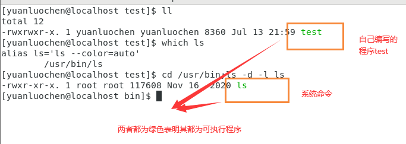
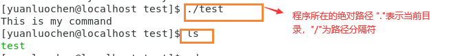
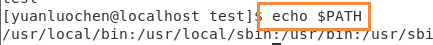
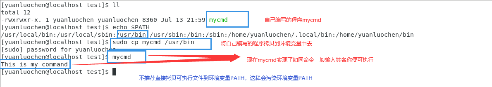
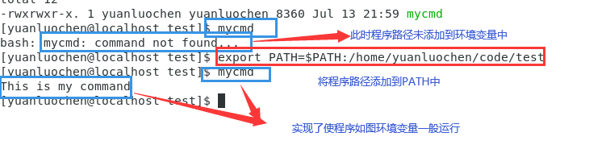

#! https://zhuanlan.zhihu.com/p/541537048
# 在Linux系统中，如何让自己的编写的程序如同命令一般存在 —— 浅谈环境变量PATH

## 前言

过去的我一直认为系统命令与个人编写的程序是两个完全不同的概念，但是我最近经过一段时间的学习发现，这二者在本质上是相同的。其二者皆为可执行程序。既然两者本质相同，但是自己编写的程序不能像系统命令一般，输入命令名称即可执行命令，这是为什么呢？

## 命令和程序之间的区别

先提出一个观点**在Linux系统中，我们可以将命令与程序统称为可执行程序**，命令与程序的本质是相同的。如下图

首先在Linux系统中文件的不同的颜色代表着文件不同的类型，例如，蓝色表是目录（文件夹），绿色表示可执行文件，红色表示压缩文件，浅蓝色表示链接文件，灰色表示其他文件。

如上图所示，自己编写的程序文件与系统命令ls所在的文件他们都是绿色，都是可执行文件。

那么为什么命令可以在终端中直接输入其命令名称（其对应的可执行文件的名称），就可以直接运行，而程序却需要在终端中输入其 **绝对路径** 才可以执行。

（并且系统命令也可以像自己编写的程序一样，通过向终端中输入其绝对路径来运行命令，如下图

）

这时我们要思考一个问题——命令在系统中是如何执行的？

首先，系统要找到该命令对应的可执行文件的位置，然后，执行该命令所对应的可执行程序。

这时我们回想，在我们执行自己编写程序时，我们向终端输入该可执行程序的路径，然后程序就执行了。

我们对比系统命令的执行和自己编写程序的执行过程。我们发现：自己编写程序的执行过程相比于系统命令的执行，系统命令的执行不需要输入其指令对应可执行程序所在的路径，就可执行，而自己编写的程序的执行，需要告诉系统可执行程序的路径才可执行。

那么这是为什么呢？

## 环境变量PATH

为什么命令所在的路径系统就可以自动找到，而自己编写的程序，系统却找不到呢？系统是怎样找找到命令所在的路径的？

这时就要引入一个概念：**在系统中可执行程序的搜索路径保存在一个全局变量——PATH，它给系统提供命令的搜索路径，是环境变量的一种**

命令与程序虽然都是可执行程序，但是命令的搜索路径保存在环境变量PATH中，系统可以在全局的环境变量PATH中搜索命令的路径，进而执行命令。

（**注**：系统利用PATH搜索命令的方式：从左到右依次进行搜索，一个路径下找不到可执行程序所在的路径，再搜索下一条路径，若找到，则停止，若找不到，则报错（command not found！）。）

那么如何查看环境变量PATH呢？

在Linux系统中，通过输入指令**echo $PATH**，如下图

## 如何将自己编写的程序变成命令？

我们将系统命令的执行与个人编写的程序的执行过程进行对比分析，对实现以上问题提出两种方案。

方案一：将自己编写的可执行程序拷贝到环境变量PATH内的某个搜索路径中。如下图

**注**：极不推荐这种方法，这种方式会污染系统的环境变量PATH。可能导致系统不稳定。

方案二：将自己编写程序所在路径追加到环境变量中。

使用命令 **export PATH=$PATH:路径**

由上我们发现 **系统本身会提供某种全局查找属性，帮我们找到特定的模块/程序**
