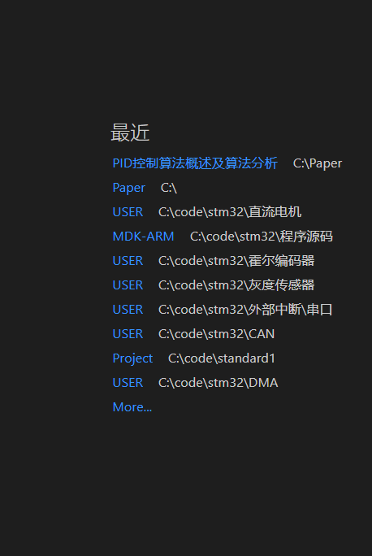

# markdown常用语法详解

## 换行不新起一段

在一行后加两个空格

你哈  
你

## 代码块

```c

int main(void)
{
    return 0;
}

```

## 公式

按两次ctrl + m

$$
i = 0
$$

## 强调

加粗，选中后按ctrl + b

年后**你哈**

斜体，选中后按ctrl + i

年后*你哈*

## 列表

数字1.加空格  
tab缩进

1. 你啊
2. 奈何
   1. 年后

## 插入图片

ctrl + alt + v


*你哈*加标题CTRL + i 一次


## 表格

| 你  | 好  | 么  |
| --- | --- | --- |
不打冒号默认左对齐

1. **右对齐**冒号打在右侧

| 你  |   好 | 么  |
| --- | ---: | --- |

1. **居中**打两个冒号

| 你  |  好   | 吗  |
| --- | :---: | --- |
| 1   |   2   | 3   |

alr + shift + f 表格格式化对其

| 你  |  好   | 吗  |
| --- | :---: | --- |
| 1   |   2   | 3   |

## 链接

复制链接 选中文字 ctrl + v复制

[链接](https://www.bilibili.com/video/BV1si4y1472o?spm_id_from=666.13.top_right_bar_window_default_collection.content.click&vd_source=fb54463fa9160b349a7111ad9b7afbf8)
