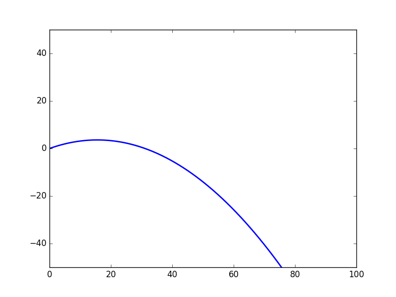
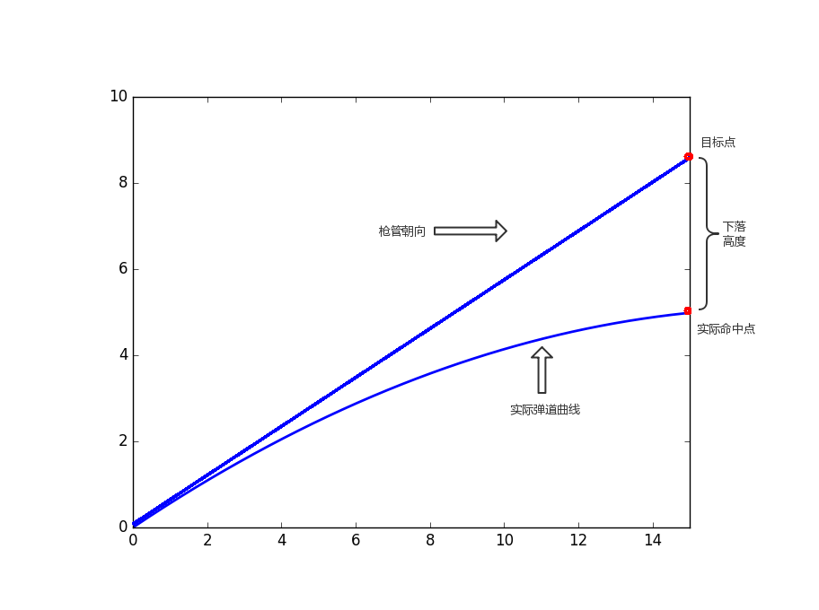

## [迭代弹道模型](#/rmoss_core/rmoss_projectile_motion/projectile_motion_iteration?id=%e8%bf%ad%e4%bb%a3%e5%bc%b9%e9%81%93%e6%a8%a1%e5%9e%8b)

- 2019.1.3 by Zhenpeng Ge, [zhenpeng.ge@qq.com](mailto:zhenpeng.ge@qq.com)

## [一、前言](#/rmoss_core/rmoss_projectile_motion/projectile_motion_iteration?id=%e4%b8%80%e3%80%81%e5%89%8d%e8%a8%80)

​ 在RoboMaster比赛中，子弹飞行模型对于命中率具有一定影响，对于远距离打击，如果不进行弹道修正，由于存在重力下落，子弹会打到目标偏下的位置。

在目前的弹道研究，多针对于实际的炮弹，或枪弹模型，考虑因素非常多，模型相对精确，也相对复杂，基本上射击微分方程的数值求解，对于实时性影响较大。

​ 在本文中，先提出一个简单的理想抛物线模型，然后加入空气阻力的考虑，并对模型进行简化，建立一个单方向空气阻力模型。

## [二、理想抛物线模型](#/rmoss_core/rmoss_projectile_motion/projectile_motion_iteration?id=%e4%ba%8c%e3%80%81%e7%90%86%e6%83%b3%e6%8a%9b%e7%89%a9%e7%ba%bf%e6%a8%a1%e5%9e%8b)

- 只考虑重力对弹道的影响，理想弹道如下，是一条抛物线。



**现在给定目标位置坐标(x,y)，求解出射角（炮台仰角）。**

- 抛物线模型是非常简单的，给出枪口仰角，子弹初速度，很容易计算它的落点。
- 但是给定落点，求解出射角度是子弹运动的逆运算，需要反推模型，其结果是可以推算出的，其优点是求解精确，但公式复杂，且存在多解，无解的情况，编程也不太方便。

基于以上考虑，这里给出了一个**基于模型前向迭代的数值解法**：

首先引入几个概念：

- 
    

显然，当我们直接瞄准目标点（枪管朝向目标点）时，会有一个下落高度。

- 我们将利用这个**下落高度**进行迭代**补偿**。

---

算法过程如下：

- 设置最终目标点targetPoint
    
- 设临时目标点tempPoint=tempPoint
    
- 循环迭代10次：
    
    - 计算仰角angle=枪管指向tempPoint的角度
        
    - 利用抛物线模型，计算实际命中点realPoint.
        
    - 得到误差，即下落高度deltaH=targetPoint-realPoint
        
    - 更新tempPoint=tempPoint+deltaH
        
- 输出仰角angle，与误差deltaH
    

---

> 非常类似机器学习中的迭代过程，调整参数，使得tempPoint趋近于targetPoint

根据算法过程，编写代码进行测试，结果如下：

```
枪口速度25.000000,目标坐标（10.000000,1.000000）
---------------------------
第1次迭代: 仰角：5.710593,临时目标点y值:1.791840,高度误差:0.791840
第2次迭代: 仰角：10.158681,临时目标点y值:1.809172,高度误差:0.017332
第3次迭代: 仰角：10.254868,临时目标点y值:1.809661,高度误差:0.000489
第4次迭代: 仰角：10.257582,临时目标点y值:1.809675,高度误差:0.000014
第5次迭代: 仰角：10.257658,临时目标点y值:1.809675,高度误差:0.000000
第6次迭代: 仰角：10.257661,临时目标点y值:1.809675,高度误差:0.000000
第7次迭代: 仰角：10.257661,临时目标点y值:1.809675,高度误差:0.000000
第8次迭代: 仰角：10.257661,临时目标点y值:1.809675,高度误差:0.000000
第9次迭代: 仰角：10.257661,临时目标点y值:1.809675,高度误差:0.000000
第10次迭代: 仰角：10.257661,临时目标点y值:1.809675,高度误差:0.000000
---------------------------
最终结果:10.257661,最终误差:0.000000
```

测试结果：

- 最终误差小于1mm（目标在30m以内），满足精度需求.
- 在6代i7cpu上测试，时间小于0.1ms，满足实时性需求
- 目标距离越近，收敛速度越快，5m目标，3次迭代，就能达到误差小于1mm。

以上均为理想模型，未考虑空气阻力，并不能在实际中应用。（未实际测试）

## [三、单方向空气阻力模型](#/rmoss_core/rmoss_projectile_motion/projectile_motion_iteration?id=%e4%b8%89%e3%80%81%e5%8d%95%e6%96%b9%e5%90%91%e7%a9%ba%e6%b0%94%e9%98%bb%e5%8a%9b%e6%a8%a1%e5%9e%8b)

​ 由于抛物线模型过于简单，所以实际应用场景并不多，但是抛物线模型是其他所有弹道模型的基础。这里我们考虑空气阻力，进一步修正模型，使得模型可以实际应用。

​ 目前，已经存在许多先进的弹道模型，但是模型过于复杂，不易理解，而且涉及微分方程数值求解，比较耗时，所以，引入空气阻力模型，但本着简化模型的原则，对其进行简化。

- 由于在比赛中，子弹飞行不会过于斜抛（吊射基地除外），所以子弹飞行过程中，受到的阻力更多来源与水平方向（x方向）。
- **假设空气阻力与速度平方成正比**

空气阻力模型 : f=k0v2 x方向: fx=f⋅cosθ=k0v2⋅cosθ y方向: fy=f⋅sinθ=k0v2⋅sinθ \begin{aligned}\text{空气阻力模型 : }&f=k_0v^2 \\ \text{ x方向: }&f_x=f\cdot cos\theta=k_0v^2 \cdot cos\theta\\ \text{ y方向: }&f_y=f\cdot sin\theta=k_0v^2\cdot sin\theta\\ \end{aligned}

- cos(10°) =0.984 , sin(10°) =0.173
- 即10度以内，x方向承担较大的阻力分量,故考虑忽略y方向的阻力，当角度较小时，做如下假设：

假设θ较小:cosθ≈1 x方向: fx=f⋅cosθ=k0v2⋅cosθ=k0v2⋅cos2θ=kovx2 \begin{aligned} 假设\theta 较小 :&cos\theta\approx1 \\ \text{ x方向: }&f_x=f\cdot cos\theta=k_0v^2 \cdot cos\theta = k_0v^2 \cdot cos^2\theta=k_ov^2_x \\ \end{aligned}

基于以上分析，**对子弹飞行做运动分解，只考虑水平方向的空气阻力**，不考虑垂直方向的空气阻力。

**x方向运动模型推导：**

空气阻力模型 : fx=k0vx2 牛顿定律: −fx/m=a=dvxdt⟹−k0mvx2=dvxdt⇒k1dt=−dvxvx2……(k1=k0m)⟹k1t+C=1vx由vx(t=0)=vx0得：C=1vx0即得到水平方向速度模型vx=vx0k1vx0t+1即得到水平方向位移模型x=∫0tvxdt=1k1ln⁡(k1vx0t+1) \begin{aligned} \text{空气阻力模型 : }&f_x=k_0v_x^2 \\ \text{ 牛顿定律: }&-f_x/m=a=\frac{dv_x}{dt} \\ & \Longrightarrow -\frac{k_0}{m}v_x^2 =\frac{dv_x}{dt} \Rightarrow k_1dt=-\frac{dv_x}{v_x^2} \dots\dots(k_1=\frac{k_0}{m}) \\ & \Longrightarrow k_1t+C=\frac{1}{v_x} \\ &由v_x(t=0)=v_{x0}得：C=\frac{1}{v_{x0}} \\ 即得到水平方向速度模型& v_x=\frac{v_{x0}}{k_1v_{x0}t+1} \\ 即得到水平方向位移模型& x=\int^t_0v_xdt=\frac{1}{k_1}\ln(k_1v_{x0}t+1) \end{aligned}

不难发现，当**阻力系数k1趋近于0**时，该模型**退化**为**理想抛物线模型**

lim⁡k1→0x=lim⁡k1→0ln⁡(k1vx0t+1)k1=lim⁡k1→0k1vx0tk1=lim⁡k1→0vx0t=vx0t \lim_{k_1\rightarrow0}x=\lim_{k_1\rightarrow0}\frac{\ln(k_1v_{x0}t+1)}{k_1}=\lim_{k_1\rightarrow0}\frac{k_1v_{x0}t}{k_1}=\lim_{k_1\rightarrow0}v_{x0}t=v_{x0}t 得到**运动模型**后，利用**基于模型前向迭代的数值解法** ，对模型进行迭代求解，步骤同上。

以下是阻力系数k1=0.1时的迭代结果

```
枪口速度25.000000,目标坐标（10.000000,1.000000）
---------------------------
第1次迭代: 仰角：5.710593,临时目标点y值:2.619620,高度误差:1.619620
第2次迭代: 仰角：14.679461,临时目标点y值:1.591977,高度误差:-1.027643
第3次迭代: 仰角：9.045448,临时目标点y值:2.229931,高度误差:0.637954
第4次迭代: 仰角：12.570891,临时目标点y值:1.828138,高度误差:-0.401793
第5次迭代: 仰角：10.360058,临时目标点y值:2.078997,高度误差:0.250858
第6次迭代: 仰角：11.744473,临时目标点y值:1.921498,高度误差:-0.157499
第7次迭代: 仰角：10.876800,临时目标点y值:2.020041,高度误差:0.098544
第8次迭代: 仰角：11.420302,临时目标点y值:1.958250,高度误差:-0.061791
第9次迭代: 仰角：11.079740,临时目标点y值:1.996943,高度误差:0.038693
第10次迭代: 仰角：11.293093,临时目标点y值:1.972693,高度误差:-0.024250
第11次迭代: 仰角：11.159414,临时目标点y值:1.987884,高度误差:0.015191
第12次迭代: 仰角：11.243165,临时目标点y值:1.978365,高度误差:-0.009518
第13次迭代: 仰角：11.190692,临时目标点y值:1.984328,高度误差:0.005963
第14次迭代: 仰角：11.223567,临时目标点y值:1.980592,高度误差:-0.003736
第15次迭代: 仰角：11.202970,临时目标点y值:1.982933,高度误差:0.002341
第16次迭代: 仰角：11.215874,临时目标点y值:1.981466,高度误差:-0.001466
第17次迭代: 仰角：11.207790,临时目标点y值:1.982385,高度误差:0.000918
第18次迭代: 仰角：11.212854,临时目标点y值:1.981809,高度误差:-0.000576
第19次迭代: 仰角：11.209682,临时目标点y值:1.982170,高度误差:0.000361
第20次迭代: 仰角：11.211669,临时目标点y值:1.981944,高度误差:-0.000226
---------------------------
最终结果:22.423358,最终误差:-0.000226
```

- 相对无空气阻力模型，有一个1度的角度修正。
- 该模型相对复杂，在收敛过程中会引入振荡，需要更多的迭代次数，保证收敛精度，即误差小于1mm（这里选择20次迭代）。

#### [c.该模型适用场景](#/rmoss_core/rmoss_projectile_motion/projectile_motion_iteration?id=c%e8%af%a5%e6%a8%a1%e5%9e%8b%e9%80%82%e7%94%a8%e5%9c%ba%e6%99%af)

- 适用于远距离，即在抛物线下降沿打中目标，否则，会造成反效果。

## [四、单方向空气阻力模型参数K求解](#/rmoss_core/rmoss_projectile_motion/projectile_motion_iteration?id=%e5%9b%9b%e3%80%81%e5%8d%95%e6%96%b9%e5%90%91%e7%a9%ba%e6%b0%94%e9%98%bb%e5%8a%9b%e6%a8%a1%e5%9e%8b%e5%8f%82%e6%95%b0k%e6%b1%82%e8%a7%a3)

理论上，获取一次测量数据，包括水平位移x，竖直位移y，仰角a，速度v。既可以求解参数k，但由于方程包含超越函数，无法直接求解。这里同样利用**基于模型前向迭代**给出数值解法。

- 计算初始k0
- 设临时k=k0
- 循环迭代200次：
    - 利用抛物线(含空气阻力)模型，计算临时命中点tempPoint（竖直位移tempY）.
    - 得到误差，即下落高度deltaH=realY-tempY.
    - 更新k=k-alpha*deltaH; (alpha为收敛速度系数，不易太大，过大会导致不收敛)
- 输出k，与误差deltaH

**k0计算：**

- 采用线性近似解

{x=1kln⁡(kvx0t+1)…(1)y=vy0t−12gt2⋯(2){ekx=kvx0t+1…(1)t=vy0+vy02−2gyg⋯(3)(1)⟹1+kx+12k2x2≈kvx0t+1⋯(4)(4)⟹k≈2(vx0t−x)x2⋯(5) \begin{aligned} & \begin{cases} x=\frac{1}{k}\ln(kv_{x0}t+1)& \dots(1)\\ y=v_{y0}t-\frac{1}{2}gt^2 &\cdots(2) \end{cases} \\ \\ & \begin{cases} e^{kx}=kv_{x0}t+1& \dots(1)\\ t=\frac{v_{y0}+\sqrt{v_{y0}^2-2gy}}{g} &\cdots(3) \end{cases} \\ & (1) \Longrightarrow 1+kx+\frac{1}{2}k^2x^2\approx kv_{x0}t+1 &\cdots(4) \\ & (4)\Longrightarrow k\approx \frac{2( v_{x0}t-x)}{x^2} &\cdots(5)\\ \end{aligned}

即，把（1）带入（5）即可得到k的近似解。

注意：

- (1)->(4)：采用二阶泰勒展开近似exp(x)。
- (3)：时间取二元一次方程的最大值，即射击点应在抛物线的下落段。故在取点时，应考虑尽可能远（大于5m）

## [五、完全空气阻力模型](#/rmoss_core/rmoss_projectile_motion/projectile_motion_iteration?id=%e4%ba%94%e3%80%81%e5%ae%8c%e5%85%a8%e7%a9%ba%e6%b0%94%e9%98%bb%e5%8a%9b%e6%a8%a1%e5%9e%8b)

基于单方向空气阻力模型，我们进一步分析，考虑x,y两个方向的空气阻力，对模型进行一些简化，方便进行模型求解。

### [a. 模型假设：](#/rmoss_core/rmoss_projectile_motion/projectile_motion_iteration?id=a-%e6%a8%a1%e5%9e%8b%e5%81%87%e8%ae%be%ef%bc%9a)

有了单方向模型推导的经验，我们依然**假设空气阻力与速度平方成正比** 。 空气阻力模型 : f=k0v2 x方向: fx=f⋅cosθ=k0v2⋅cosθ y方向: fy=f⋅sinθ=k0v2⋅sinθ \begin{aligned} \text{空气阻力模型 : }&f=k_0v^2 \\ \text{ x方向: }&f_x=f\cdot cos\theta=k_0v^2 \cdot cos\theta\\ \text{ y方向: }&f_y=f\cdot sin\theta=k_0v^2\cdot sin\theta\\ \end{aligned} 显然，fx与fy与子弹飞行的姿态有关，x,y方向运动并不能完全分解，为了简化计算过程，故做以下假设

**空气阻力假设:**  x方向: fx^=fx⋅cosθ=k0v2⋅cos2θ=k0vx2<fx y方向: fy^=fy⋅sinθ=k0v2⋅sin2θ=k0vy2<fy \begin{aligned} \text{ x方向: }&\hat{f_x}=f_x\cdot cos\theta= k_0v^2\cdot cos^2\theta =k_0v^2_x<f_x\\ \text{ y方向: }&\hat{f_y}=f_y\cdot sin\theta= k_0v^2\cdot sin^2\theta =k_0v^2_y<f_y\\ \end{aligned}

有了以上假设，就可以进行运动分解，两个方向单独计算，x方向还是和单方向空气阻力推导过程一样，只需要完成对y方向的模型推导即可。

### [b. y方向运动模型推导：](#/rmoss_core/rmoss_projectile_motion/projectile_motion_iteration?id=b-y%e6%96%b9%e5%90%91%e8%bf%90%e5%8a%a8%e6%a8%a1%e5%9e%8b%e6%8e%a8%e5%af%bc%ef%bc%9a)

对于y方向的阻力，如果弹道轨迹上升到抛物线最高点，空气阻力方向会发生改变，故这里为简化计算，**假设y方向上升过程，存在空气阻力，下降过程无空气阻力。** 基于以下因素：

- 上升段，y方向空气阻力阻碍物体上升，表现为负补偿，需要加大补偿力度，下降段，阻碍物体下降，为正补偿作用。这里的正补偿作用可以补偿之前忽悠掉的其他因素。
- 且下降过程速度相对较小，优先射击点在上升段，以及下降过程较短等因素

**(1)上升过程：** 空气阻力模型 : fy=k0vy2 牛顿定律: −fy−mg=ma=mdvydt⟹−k0mvy2−g=dvydt⇒−dt=dvxk1vx2+g……(k1=k0m)⟹−t+C=1k1garctan(k1gvy)由vy(t=0)=vy0得C=1k1garctan(k1gvy0)即得到竖直方向速度模型vy=gk1tan(k1g(C−t))⋯⋯(t<C)即得到竖直方向位移模型y=∫0tvydt=1k1∫k1g(C−t)k1gCtan(z)dz=1k1⋅ln⁡cos(k1g(C−t))cos(k1gC)⋯(0<t<C)特别，到达最高点有ymax=1k1⋅ln⁡1cos(k1gC)=12k1ln⁡(1+k1gvy02)⋯(t=C) \begin{aligned} \text{空气阻力模型 : }&f_y=k_0v_y^2 \\ \text{ 牛顿定律: }&-f_y-mg=ma=m\frac{dv_y}{dt} \\ & \Longrightarrow -\frac{k_0}{m}v_y^2-g =\frac{dv_y}{dt} \Rightarrow -dt=\frac{dv_x}{k_1v_x^2+g} \dots\dots(k_1=\frac{k_0}{m}) \\ & \Longrightarrow -t+C=\frac{1}{\sqrt{k_1g}} arctan(\sqrt{\frac{k_1}{g}}v_y)\\ & 由v_y(t=0)=v_{y0}得C=\frac{1}{\sqrt{k_1g}} arctan(\sqrt{\frac{k_1}{g}}v_{y0})\\ 即得到竖直方向速度模型& v_y=\sqrt{\frac{g}{k_1}}tan\left(\sqrt{k_1g}({C-t)}\right) \cdots\cdots(t<C)\\ 即得到竖直方向位移模型& y=\int^t_0v_ydt=\frac{1}{k_1} \int^{\sqrt{k_1g}C}_{\sqrt{k_1g}(C-t)}tan(z)dz=\frac{1}{k_1}\cdot \ln{\frac{cos(\sqrt{k_1g}(C-t))}{cos(\sqrt{k_1g}C)}} \cdots(0<t<C)\\ 特别，到达最高点有&y_{max}=\frac{1}{k_1} \cdot\ln{\frac{1}{cos(\sqrt{k_1g}C)}}=\frac{1}{2k_1}\ln(1+\frac{k_1}{g}v^2_{y0})\cdots(t=C) \end{aligned} **(2)下降过程：** y=−12gt2 y=-\frac{1}{2}gt^2 **(3)空气阻力补偿:**

在子弹飞行上升过程中，由于速度角度（速度与水平夹角）是逐渐减少的，趋近于0。 速度夹角：θ→0,则sinθ→0,cosθ→1 x方向: fx^=fx⋅cosθ→fx y方向: fy^=fy⋅sinθ→0而且，θ一般不会太大，大部分情况有：0<θ<π4; \begin{aligned} 速度夹角：&\theta\rightarrow0,则sin\theta\rightarrow0,cos\theta\rightarrow1 \\ \text{ x方向: }&\hat{f_x}=f_x\cdot cos\theta \rightarrow f_x\\ \text{ y方向: }&\hat{f_y}=f_y\cdot sin\theta \rightarrow 0\\ &而且，\theta一般不会太大，大部分情况有：0<\theta<\frac{\pi}{4}; \end{aligned}

所以，x方向无需补偿，y方向需要进行空气阻力补偿，以减小模型误差，这里补偿  y方向: fy^=fy⋅sinθ⋅1sinα其中α为射击初始角度θ0,这里把系数1sinα与k和并得：k1^=k1∗1sinα(α>0) \begin{aligned} &\text{ y方向: }\hat{f_y}=f_y\cdot sin\theta\cdot\frac{1}{sin\alpha} \\ &其中\alpha为射击初始角度\theta_0,这里把系数\frac{1}{sin\alpha}与k和并得：\\ &\hat{k_1}=k_1*\frac{1}{sin\alpha} (\alpha>0) \end{aligned} 即，对y方向，进行空气阻力系数补偿。

**k1求解方式：**

- **数值求解**：利用一次测试数据，求解参数k1。参考单方向空气阻力模型k迭代求解法。
- **经验求解**：不断调整k1，取得相对合适的值。
- **理论求解**：k1=k0/m；利用物理理论求解空气阻力系数k0（f=k0*v^2），即可得到k1.

### [c. 最终混合模型](#/rmoss_core/rmoss_projectile_motion/projectile_motion_iteration?id=c-%e6%9c%80%e7%bb%88%e6%b7%b7%e5%90%88%e6%a8%a1%e5%9e%8b)

事实上，仅仅单独考虑两个方向的空气阻力是不够的，因为空气阻力不一定就是负作用，也可能产生正作用。

子弹方向过程中，可分别考虑上升段和下降端。

- 推导略

---

Powered by [docsify](https://docsify.js.org/), this work is licensed under [CC BY-SA 4.0](https://creativecommons.org/licenses/by-sa/4.0/)