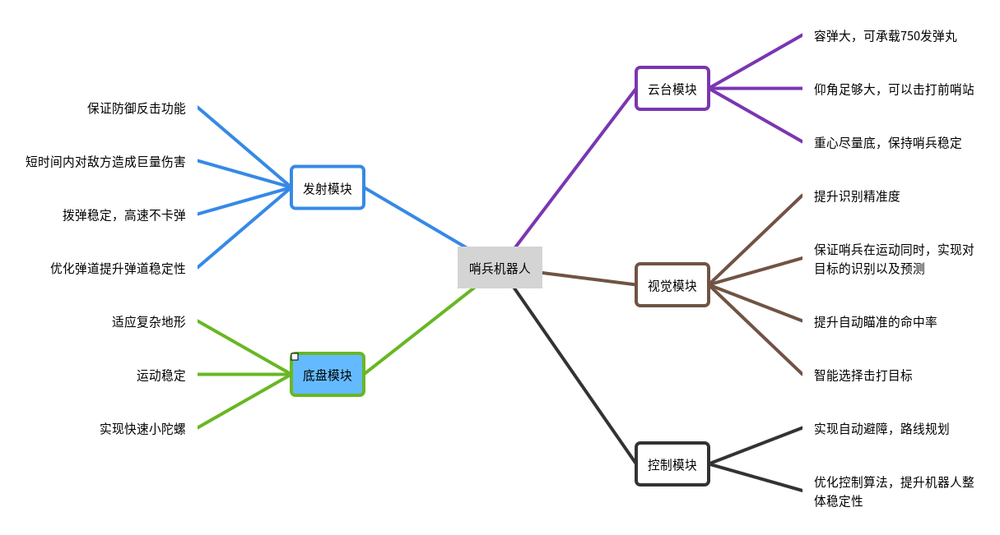
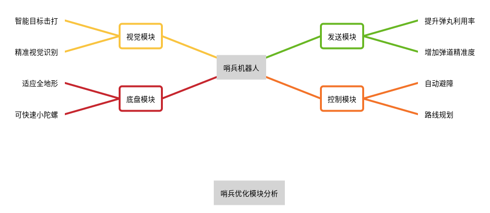

# 哨兵赛季规划

## 需求分析

在新赛季，哨兵摆脱了一维轨道的束缚，不再像传统的哨兵机器人，仅可作为后方的一道防线，守护己方基地，而可作为一名勇敢的先锋为我方作战。新赛季哨兵机器人可在己方前哨站未攻破的情况下处于无敌状态，在此状态下完全可以让哨兵机器人攻打敌方前哨站，辅助我方机器人作战。在前哨站被击破的情况下，哨兵可以有更强的机动能力，更强的对敌作战能力，以守护我方基地。基于以上需求，哨兵在机械设计，机器人控制，视觉识别要有极大的提升，机械设计要不同于以往的哨兵，其要有飞坡，适应复杂地形的能力，为此在哨兵底盘层面上要有巨大设计提升，在机器人控制上，要使机器人控制更加精准，更加稳定，为此要在控制算法上要有更大提升，以及要加入ROS，slam技术，使哨兵机器人更好的规划运动路线，在视觉识别上，优化视觉识别算法，优化深度学习算法，提升识别精准度，以及预测准确性，根据战况智能判断优先击打目标，实现目标的智能击打，哨兵赛季规划如下图。

## 主要优化模块分析

## 设计思路

| 模块     | 需求分析                                                                                                                                   | 设计思路                                                                                                                                                                                                                                                                                                |  
| -------- | ------------------------------------------------------------------------------------------------------------------------------------------ | ------------------------------------------------------------------------------------------------------------------------------------------------------------------------------------------------------------------------------------------------------------------------------------------------------- | 
| 底盘模块 | 适应全地形，并可实现快速小陀螺。                                                                                                           | 采用稳定的麦克纳姆轮底盘，独立式悬挂设计保证其在复杂地形的运动的稳定性，并且可实现快速小陀螺。                                                                                                                                                                                                          | 
| 发射模块 | 保证防御反击功能，能够短时间内对敌方造成巨量伤害。                                                                                         | 采用双发射机构，以使得750发弹丸的利用率尽可能高，并且形成火力覆盖。提升拨弹结构，采用更短的弹链，更加稳定的拨弹盘，使拨弹稳定运行                                                                                                                                                                       | 
| 云台模块 | 能够承载750发小弹丸，并且有足够大的仰角以保证能够对前哨战造成血量削减。重心尽量底，保持哨兵的稳定。                                        | 采用半下供弹的方式，将弹仓置于pitch轴以保证750发弹丸的存储容量，并且尽量减少弹链的长度。基于双发射机构选择弹仓分置于yaw轴，减少因为双拨弹盘同时工作而造成干扰。基于pitch轴双发射机构过重因素，采用双3508电机共同驱动pitch轴俯仰，以达到发弹稳定的目的。在设计时考虑布线规范，为视觉算法电器元件预留位置 |
| 视觉模块 | 提高视觉识别的精准度，保证在哨兵运动的情况下，实行对敌方目标的精准识别以及预测，智能选择击打目标，实现在多目标的情况下，对目标进行合理击打 |  结合上海工程技术大学木鸢Birdiebot视觉框架开源对装甲板识别代码进行改进，基于已有的设备优化代码，使其能发挥最大的作用。运用P4P解算对在运动状态下的机器人进行位置的判断。结合卡尔曼滤波和粒子滤波对机器人的位置和装甲板的下一步位置进行预测，使其能够精准打击装甲板|                                                                                                                                                                                                                                                                                               
| 控制模块 | 实行自动避障，以及路线规划，提升哨兵整体稳定性 | 向哨兵机器人内加入ROS，以及Slam技术，为路线规划，自动避障提供支持，采用matlab，对路线规划进行合理仿真。利用matab定制控制算法，并进行仿真，优化控制算法的稳定性 |
