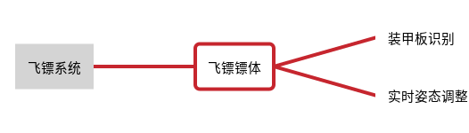

# 飞镖弹体赛季规划

## 需求分析

在新赛季飞镖系统作用十分重要，当飞镖发动空中打击，命中前哨站装甲板，以及基地装甲板时，会对其造成巨大伤害，但是其命中率极低，究其原因，我们发现飞镖无法准确调整飞镖姿态，无法正中装甲板，所以在新赛季，为提高飞镖命中率，必须要正确检测到装甲板，根据检测数据实时调整飞镖姿态，使飞镖精确命中装甲板。

## 设计思路

| 模块 | 需求分析 | 设计思路 |
| ---- | -------- | -------- |
| 飞镖镖体 | 正确检测装甲板，实时姿态调整   |  采用激光制导，通过镖体检测装甲板机关反射激光数据，利用matlab构建镖体数学模型，针对该数学模型，设计控制算法实时调整飞镖姿态|
