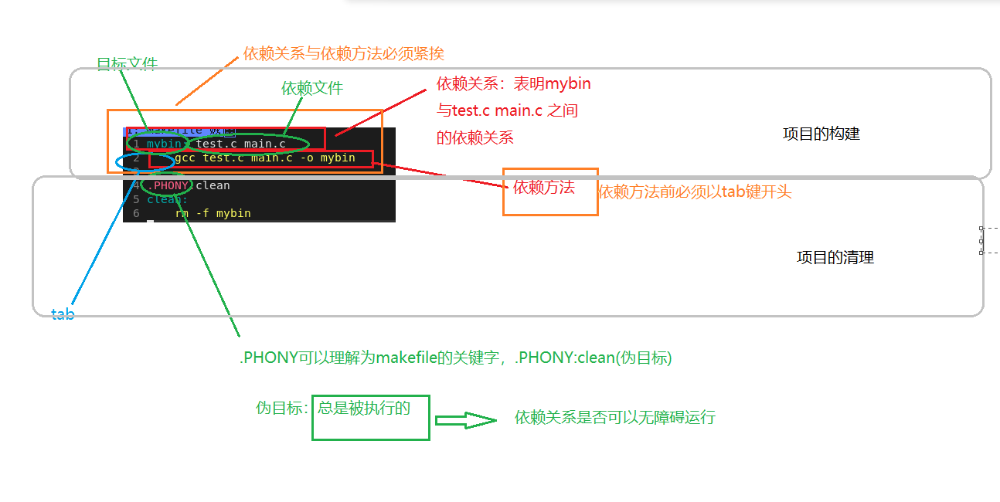
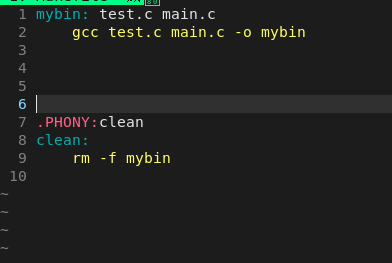
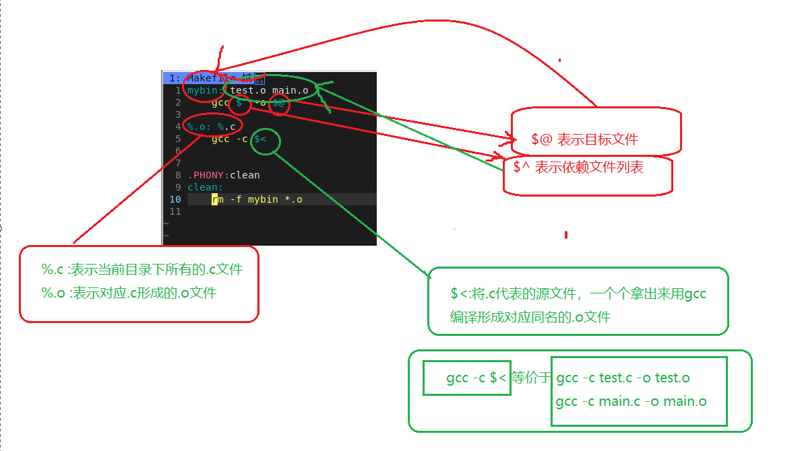
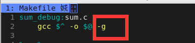

# Linux书写代码

## Linux系统的软件管理

软件安装

yum install

软件卸载

yum remove

软件更新

yum update

## vim的使用

### vim模式转换

vim 默认命令模式

命令模式转为 -> 插入模式

1. a : 光标后移
2. i : 不变
3. o ：新起一行
4. s ：删除一个选定元素

插入模式 -> 命令模式

ESC

命令模式 -> 底行模式

：（shift + ；）

底行模式命令

1. w ：保存
2. q ：退出
3. w！：强制保存
4. q！：强制退出
5. wq! ：强制保存并退出

底行模式 -> 命令模式

ESC

vscode快速进入终端

ctrl + ·

vscode快速新建终端

ctrl + shift + ·

### vim底行模式命令

调出行号 set nu

关闭行号 set nonu

！+ 终端命令 快速运行终端命令

### 命令模式命令

#### 光标定位

将光标定位到本行的行尾

$ $ $ (shift + 4)

光标定位行首

^ (shift + 6)

光标定位到文本结尾

G (shift + g)

光标直接定位到文本开始

gg

光标定位到特定行

特定行号 + G (shift + g)

以单词进行移动

向前 b 向后 w

一字符为单位进行移动

h : 向左移动
j : 向下移动
k : 向上移动
l : 向右移动

#### 文本操作

(n批量) yy 复制光标所在行
(n批量) p 粘贴，默认粘贴到当前行的下一行

撤销 u

剪切光标所在行 (n批量) dd

删除光标所在位置的字符之后相同的字符 （n批量）  x
删除光标所在位置的字符之前相同的字符 （n批量）  X(shift + x)

~ (shift + `) 大小写转换

快速进入文件，底行模式，vs 完整的文件名（如无该文件则会自动创建）

ctrl + w + w 两个桌面间光标位置切换

### vim配置

所谓的vim基本配置，本质是将我们的配置项放入 **.vimrc** 文件

直接输入以下命令直接配置 ———— 此配置来源于[Github](https://github.com/askunix/VimForCpp)

**curl -sLf https://gitee.com/HGtz2222/VimForCpp/raw/master/install.sh -o ./install.sh && bash ./install.sh**

## gcc编译文件

从c语言变成可执行程序过程

code.c -> bin(可执行程序) —— 程序的翻译(编译)

### 文件翻译过程

 1. 预处理
    1. 头文件展开
    2. 去注释
    3. 宏替换
    4. 条件编译
 2. 编译
    1. 把C语言变为汇编语言
 3. 汇编
    1. (将汇编语言变为.o目标二进制文件，不可执行)
 4. 链接
    1. 本质引入在代码中使用的第三方库

### gcc的使用

#### 直接翻译文件使其直接翻译为为可执行文件

命令 **gcc 被翻译的文件名**

命令 **gcc 被翻译的文件 -o 翻译完成后的可执行程序名**编译文件

#### 分布翻译文件

文件预处理

命令 **gcc -E test.c -o test.i**

将翻译的文件在预处理完成后停下来所生成的临时内容放于test.i中

文件编译

命令 **gcc -S test.i(test.c也可) -o test.s**

将test.i（即存放预处理完成后的内容的文件）(或test.c)在编译完成后停下来，将其生成的临时文件放在test.s

文件汇编

命令 **gcc -c test.s -o  test.o**

将test.s这个临时文件在汇编完成后停下来，将其生成的临时内容写入于 test.o 内

文件链接

命令 **gcc test.o -o 新命名的可执行文件名**

##### Linux系统中的库

Linux系统中.so结尾 ：动态库
           .a结尾 ： 动态库

Linux系统中库真正的名字。是去掉前缀lib，去掉.XXXX,剩下来的就是库的真正的名字

动态链接形成的可执行程序比较小

静态链接形成的可执行城西比较大

## make/makefile项目自动化构建工具

make是一条命令，makefile是文件

一旦写好一个makefile文件，只需要一个make命令就可以自动化编译

### 多文件编译

对文件编译，最好是将对文件先统一编译为目标文件(.o)，然后将目标文件链接生成bin

### Makefile使用方式

1. 创建一个在当前目录下(需要编译文件的目录)的名称为Makefile/makefile文件

2. makefile的书写方法

makefile核心构成

1. 依赖关系
2. 依赖方法

编写makefile本质上是在编写依赖关系与依赖方法

%.o : 表示当前目录下的所有的.c文件

%.c ：表示当前目录下的所有的.o文件

$^ :右侧依赖列表的众多文件 $@ :左侧目标文件 $<第一个目标文件

.PHONY 建立伪目标

### Makefile注意事项

1. 输入make命令仅执行首条依赖方法
   原因： 输入make命令，makefile文件自动执行，执行到一依赖方法后停止
2. make命令不可总是被执行
   原因： make一般为对文件进行翻译。若可以总是被执行，则翻译成本过大。

缓冲区  
刷新策略

1. 无缓冲(立即)
2. 行缓冲(/n)
3. 全缓冲(缓冲区满的时候再刷新，磁盘文件file)

程序退出自动刷新。

fflush()刷新

/n/r

/n 换行符 /r 回车

## git

git : 是一款版本管理的软件(多人协作，分支管理，分发流程)

github是一个网站形式的服务器，对外提供版本管理服务，底层使用的是git技术

### git相关的操作

git clone HTTP   克隆git

git status       查看状态

git add          添加文件

git commit -m "" 提交日志

git push         提交

## gdb

gdb：默认是以release方式发布的！不可被调试的

release是一般软件进行发布，并交付给用户的模式
debug：生成的软件内部，是包含了调试信息

debug生成的程序，在体积上一定大于release

Linux在gcc命令后加 -g选项，直接gdb

选定调试文件gdb + (debug)类型的文件

调试

1. 发现问题
2. 定位问题(gdb)
3. 分析问题(gdb辅助)
4. 解决问题

调试的本质是定位问题

定位问题：找到问题所在行，或者区域

### gdb调试过程

打断点 **b 行数**

跑程序断点处就停下 **r** (run)

单步执行逐过程 **n** (next)

逐过程遇到函数直接运行不进入函数

**l** 显示器代码

**info b** 查看断点

**d 断点编号** 删除断点

**s** (step) 进入函数，逐语句

**display 变量名** 常显示变量值，监视

**undisplay 变量名** 取消常显示变量名

**until 行号** 跳转到指定行

**finish** 结束函数调用，然后停下。
