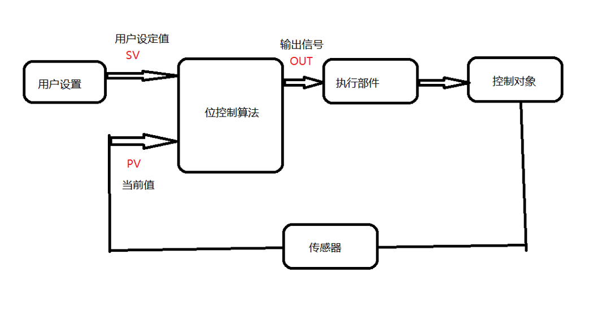
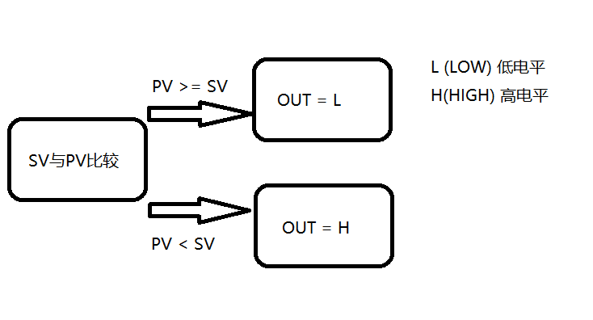
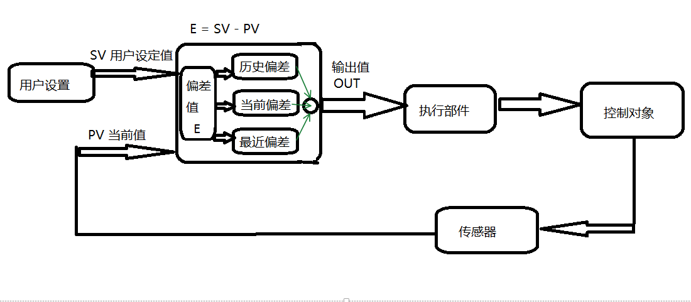
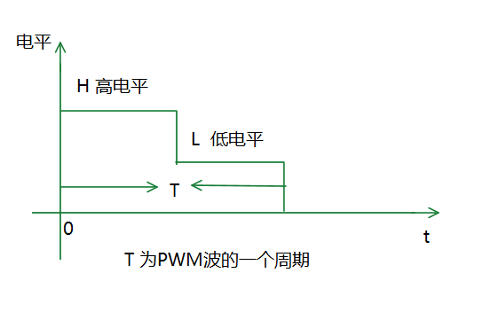
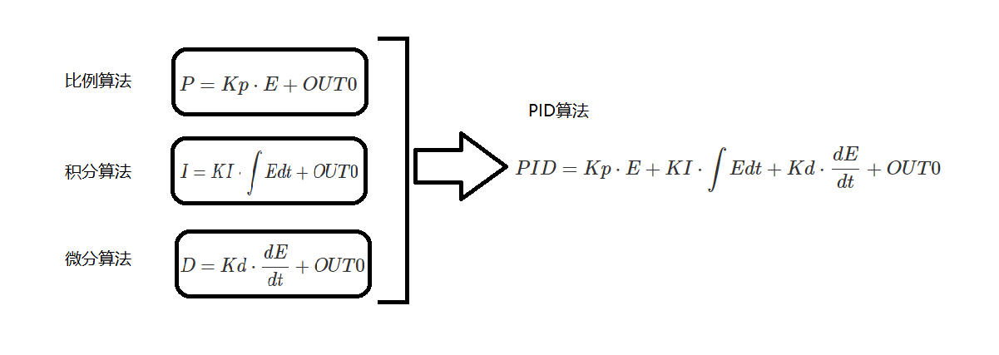
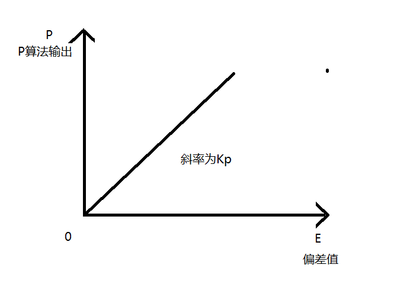
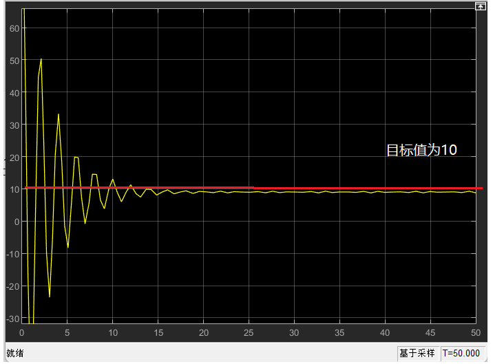
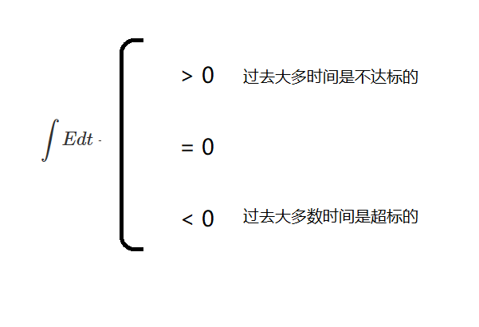

# PID控制算法概述及算法分析

## 1.0.0 PID控制算法概述

PID控制算法为**P算法**（比例算法）、**I算法**（积分算法）、**D算法**（微分算法）三种算法的合成。在介绍PID控制算法之前，先介绍传统的位式控制算法以便更好的理解PID控制算法。

### 1.1.0 传统的位控制算法

#### 1.1.1 传统的位控制算法的控制过程

如下图所示

用户通过按键或可调电阻设定一个值**SV**，**SV**与传感器读取控制对象的当前数值**PV**进行比较，比较后得出值并作为输出信号**OUT**，输出给执行部件，执行部件得到输出信号**OUT**后，执行部件对控制对象执行输出信号**OUT**，传感器获取控制对象的当前值，再不断重复进行以上步骤。

#### 1.1.2 传统的位控制算法实现原理

传统的位控制算法通过比较用户设定值**SV**与当前值**PV**，以此来判定输出值**OUT**，如下图所示

当前值**PV**大于等于用户设定值**SV**时，输出低电平；当前值**PV**小于用户设定值**SV**时，输出高电平。

以温度控制为例，假设加热一物体，此物体初始温度为零，目标设定令其加热到100摄氏度。初始时，物体温度低于目标设定值100摄氏度即PV小于SV，位控制算法输出OUT的值为H即输出高电平，物体处于加热状态；当物体当前温度PV大于或等于目标设定值SV，位控制算法输出值OUT值为L即低电平。

#### 1.1.3传统的位控制算法的缺陷

传统的位控制算法算法逻辑简单，仅考虑当前值与设定值的大小关系，不考虑其他因素。输出值仅有两种情况即**H高电平**与**L低电平**，控制时易受物体惯性影响，控制效果不佳。

仍以温度控制为例，与上例相同，初始温度为零的物体加热到100摄氏度，初始时对物体进行加热，加热时由于输出信号为高电平，且为持续高电平，所以加热为恒定温度加热，当物体加热到100摄氏度时，传统的位控制算法输出信号为低电平，即物体停止加热，物体自身会具有一定惯性，尽管停止加热，但物体温度仍然会上升一段时间。之后物体温度迅速下降，物体温度低于设定值，物体又开始被加热。**在这种算法的控制下，物体要不被持续且温度恒定的高温加热，要不仅在外界温度的影响下持续散热**。就像一个物体要不被放在岩浆要不被放在寒冰中一样，温度难以稳定。所以这种控制算法难以做到对控制对象的有效的控制。

### 1.2.0 PID控制算法

#### 1.2.1 PID控制算法的控制

如下图所示

PID控制算法控制过程总体上与传统的位控制算法相同，但在数据处理与输出信号上有很大的区别。

PID控制算法通过对偏差值**E**(E = SV - PV)进行三方面考量，即通过对偏差值的历史数据进行考量，对偏差值的当前数据进行考量，以及通过分析最近数据，得出控制对象未来发展趋势，将以上三方面数据进行综合分析预测控制对象未来可能发生的变化，针对其未来可能发生的变化，得出输出值OUT，且输出为以PWM信号。

输出值OUT为PWM信号的高电平时间，以此可以通过改变PWM信号一周期内高电平所占时间即占空比来改变输出信号的平均功率，即以温度控制为例，在偏差值不同的情况下，输出不同平均功率的信号，更加精准的对控制对象进行控制

## PID算法的算法分析

如同所示

PID算法分为比例算法（**P**算法）,积分算法（**I**算法），微分算法（**D**算法）三种算法的结合。P算法是对控制对象的当前状态进行控制。I算法，通过分析控制对象的历史数据，并对其进行控制；D算法通过分析最近几次控制对象的数据，得出控制对象的未来法制趋势，对现在的控制对象进行控制。

**PID算法的思想可以总结为：通过对控制对象的数据进行处理，以此来预测控制对象未来可能发生的变化，并对其提前进行控制。即，在问题发生之前将问题解决。**

PID算法具体公式如下

$$ PID = Kp \cdot E + KI \cdot \int E dt + Kd \cdot \frac{dE}{dt} + OUT0$$

其中**E**为偏差值（E = SV - PV），OUT0为输出常数。

### 比例算法（P算法）的算法分析

比例算法公式如下。

$$ P = Kp \cdot E + OUT0$$

**Kp**为比例常数，由用户根据不同情况进行动态调整，E为偏差值，其为目标值**SV**与当前值**PV**的差值，即 ^aa51c7

$$ E = SV - PV $$

由比例算法公式可得，当偏差值越大，P算法输出越大，对控制对象的控制越强，相反，对控制对象控制越弱，这样可以实现对控制对象的当前值进行有效控制。

#### 常数OUT0在比例算法中的作用

但在我进行学习时我就好奇，比例算法公式后加的常数**OUT0**有何作用？假设将比例算法公式中的常数值**OUT0**除去。得到公式如下

$$
P = Kp \cdot E
$$

由以上公式可得P算法的输出值与偏差值E之间成正比关系。

咋看公式好像毫无问题，当进行具体的分析以后，就发现了问题的所在。在对控制对象进行控制的过程中。正常来讲，在仅有P算法运行的情况下，控制对象的当前值PV会越来越趋近于用户设定值SV。即，如下图一样

但是，当消去**OUT0**之后的结果并非如此。当消去**OUT0**后，偏差值**E**为0时，比例公式**P**的值为0，比例算法对控制对象无控制作用，此时控制对象处于浮空状态，极易受外界因素影响，导致控制对象不稳定。为防止这种现象的发生。在比例算法后加上一个常数值，以防止控制对象偏差值为零时，被控对象处于失控状态。

所以比例算法公式为

$$
P = Kp \cdot E + OUT0
$$

### 积分算法（I算法）的算法分析

积分算法公式如下：

$$ I = KI \cdot \int E dt + OUT0 $$

**KI**为积分常数，其数值可根据用户需求进行改变。 ^1f2e6d

比例算法通过对历史数据进行求和，对所得的数值进行分析，以此对历史数据进行分析。分析所得数值有以下三种情况。

根据对历史数据进行分析，输出积分算法数值。

#### 常数OUT0在积分算法中的作用

常数OUT0在积分算法中的作用与比例算法相似，但略有不同，首先由上图所示积分项的数值大小表示，被控对象历史状态。积分项大于0，表示被控对象过去大多数时间是不达标的；积分项小于0，表示被控对象过去大多数时间是超标的；积分项等于0，表示受控对象过去大多数时间状态良好。但过去状态良好，并不代表未来状态也良好。因此需要加一个常数值**OUT0**，以让其即使过去状态良好，依旧处于受控状态。

### 微分算法（D算法）的算法分析

微分算法公式如下

$$ D = Kd\cdot \frac{dE}{dt} + OUT0$$

**Kd**为微分常数，可更改。微分算法的工作依据为分析偏差值是否有变化趋势，若有变化趋势，则开始控制，若无变化趋势，则对其不进行控制。但在实际应用的过程中要加常数OUT0以防止被控对象失控。 ^f56bbe

### PID算法的整体分析

对以上三种算法进行加和就得出了PID算法公式

$$ PID = Kp \cdot E + KI \cdot \int E dt + Kd \cdot \frac{dE}{dt} + OUT0$$

PID算法通过对控制对象的当前数据，历史数据，未来发展趋势，进行综合分析，得出输出数值，其通过改变PWM波的占空比（或高电平时间），改变其输出功率的平均值，精准的对控制对象进行控制。
