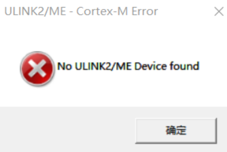
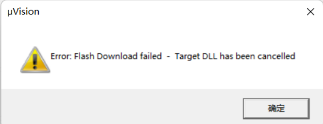
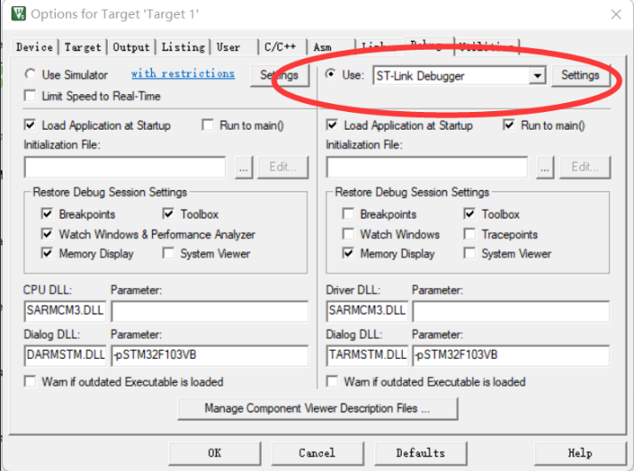
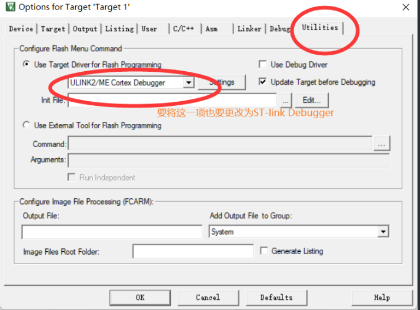
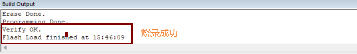

#! https://zhuanlan.zhihu.com/p/545349424
# Keil 报错"No ULINK2/ME Device found"的解决方案

最近在将一原本为利用ULINK进行烧录的keil程序更改为stlink进行烧录，但是在烧录时报错

我一直在想我已经将魔法棒的Debug更改为ST-link

我这时在想我都已经从开始的ULINK debug更改到ST-Link Debugger 为什么还要报这个错误呢？

经过一波查找资料发现，在更改烧录器时不仅要更改debug的 **Use**，还要更改**Utilities**的**Use Target Driver for Flash Programming**

更改后如图
!更改](2022-07-23-20-40-20.png)

这时我们点击debug或download，程序就会正常烧录，如图。

