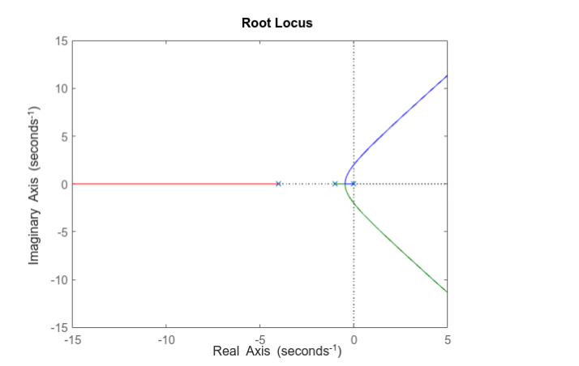
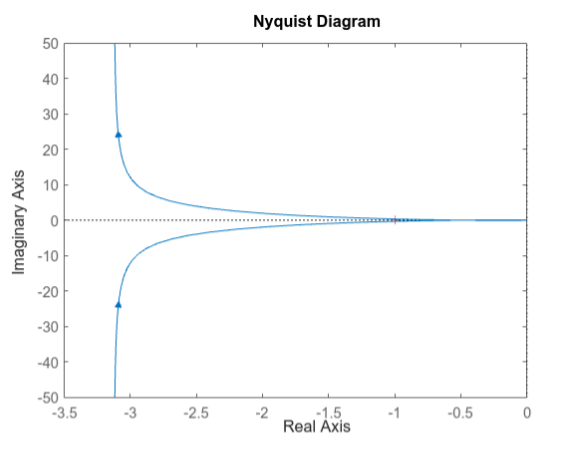
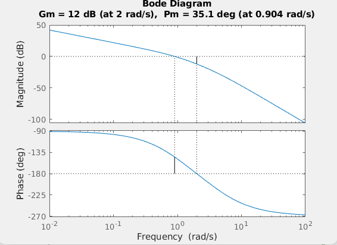
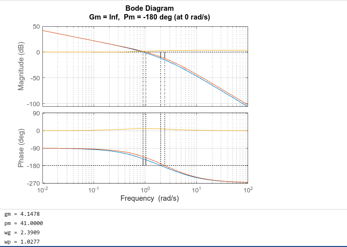

  ## 系统根轨迹
 
 
 系统根轨迹如上图所示，K变化对系统性能影响如下。
- $$0 < K < 0.83\\系统处于过阻尼状态\\t_p不变\\ \sigma\% 不变 \\ t_s 减小$$
- $$0.83 < K  < 20\\系统处于欠阻尼状态\\t_p减少\\ \sigma\% 增大\\t_s增加$$
- $$K > 20\\系统处于不稳定状态$$

## Nyquist曲线图
当$K = 5$时，系统的Nyquist图如下
根据Nyquist稳定性判据，系统处于稳定状态

## 系统Bode图
根据系统校正要求，要求校正后的系统静态速度误差系数为$K_v \ge 5(s^-1)$，根据计算得到系统的增益$K = 5$。绘制系统Bode图如下

原系统的相角裕度等于35.1376，幅值裕度等于4.0，如下图所示

## 系统校正器的设计
根据系统校正要求，要求校正后的系统满足，相角裕度$\gamma = 41$，设计系统校正器。
根据计算系统当前相角裕度为35.1376度，小于要求相角裕度，设计串联系统超前校正装置完成系统校正，超前校正装置设计如下
```matlab
clc;
clear;
sys0 = zpk([], [0, -1, -4], 5)
margin(sys0)
[gm0, pm0, wg0, wp0] = margin(sys0)

phim=(63.934 - pm0)*pi/180; 
alpha = (1 - sin(phim)/(1 + sin(phim)))
[mag, phase, w] = bode(sys0);

% 计算截止频率
[mu, pu] = bode(sys0, w);
adb = 20 * log10(mu);
am = 10 * log10(alpha);
adb = reshape(adb,60,1);
wc = spline(adb, w, am);
 
% 计算 T
T = 1 / sqrt(alpha) / wc

% 校正环节的传递函数
nc = [T, 1];
dc = [alpha * T, 1];
sysc = tf(nc, dc)

% 校正后的系统的传递函数
sys = sys0 * sysc

hold on, margin(sys), hold on, margin(sysc),grid on
[gm, pm, wg, wp] = margin(sys)
```

校正前后系统和校正装置的Bode图如下，系统相角裕度为41度
